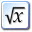
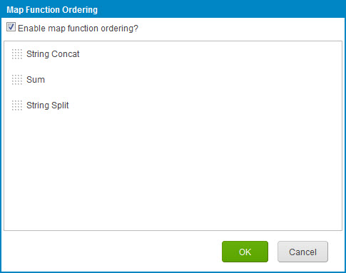
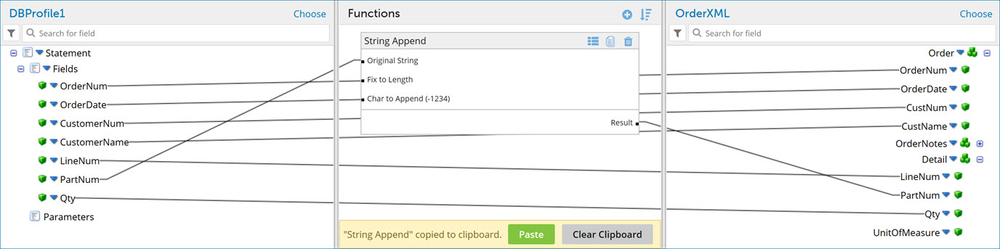

# Map Function components

<head>
  <meta name="guidename" content="Integration"/>
  <meta name="context" content="GUID-5F449F9F-2C79-46EB-BA28-1A007F38C816"/>
</head>

Map functions allow transformation logic to be applied to individual field values as they are being mapped. For example, you may want to convert a character to uppercase, to a Japanese character, change the format of a date, or look up a value in a database.

There are two main types of functions:

-   Standard — Standard functions perform a single step such as converting a value to uppercase, converting to Japanese characters, or performing mathematical operations. See the full list of standard functions linked below.

-   User-Defined — User-defined functions enable sophisticated transformations by allowing you to link multiple standard functions steps together in a defined sequence. They are saved as standalone components and can be reused in multiple maps.

Any function input can be mapped from the source data. This includes inputs like Fix to Length, String to Search, and Value to Multiply, however, these values are often static and therefore configured as default values.

You can access the **Get Functions Require Input** option in the Map Function Config dialog by clicking the three dots in the Function column. This option is selected by default, requiring input data for Get functions to run. When cleared, you can pass empty or partial source values, and the Get functions will still run.

## Map function caching

When you add a standard function to a Map step, you can enable map function caching in that step. Map function caching allows you to avoid re-executing expensive and time-consuming operations such as database or connector calls. If map caching is enabled for a function, every time the Map step’s function executes it records the inputs for the function and the returned output. On a subsequent call if the input is the same, the previously returned output is returned rather than re-executing the map function.

These options control how long the cached results are held, that is, how frequently the map function cache is cleared. They appear in the Configure Defaults dialog.

-   None \(the default\) — Map function caching is not used.

-   By Document — The map function cache’s values are cleared after each document is processed.

-   By Map — The map function cache is not cleared. Its values are available for all documents processed by the map.

Map function caching differs from document caching in two ways: you cannot select documents from other sources and put them into a map function cache, and a map function cache cannot be used elsewhere in the process. If you want to do either of those things, use a Document Cache component instead.

## Map function execution order

Map Function Ordering can be enabled for a map. This lets you control the order in which map functions are applied.

-   Map Function Ordering is off by default. All map functions are applied to one input document at a time. The order in which functions are applied is non-deterministic and may vary from one process execution to the next or even from one document to the next.

-   If Map Function Ordering is on, individual map functions are applied one at a time in the configured order to all input documents in succession. Map function ordering is useful, for example, when you need to store a value in a process property and use a different function to extract that value. Map function ordering may also be useful with specialized summing functions using process properties or external systems. You should only enable Map Function Ordering if you need it, though, because it impacts performance.

    The Map Function Ordering dialog is used to enable and configure map function ordering.

    

    To open the dialog click ** Order function executions** in the Functions column.

## Map Function copy and pasting

The Map Functions that are defined within your Map component or the individual Map Function steps that make up a user-defined Function can be copied. When a Map function or a Map Function step is copied, it can be pasted either into the same Map or Map Function component or another one in the same account or any account that you have access to.

