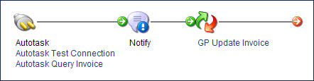

# Notify step

<head>
  <meta name="guidename" content="Integration"/>
  <meta name="context" content="GUID-A66099B2-6AFE-486E-B087-E2B77330F35F"/>
</head>

The Notify step gives you the option to build custom execution logs and/or send customized notification messages to your subscribed email alerts or RSS feed. These notifications can be either static messages or include dynamic content by using input parameters. Email subscriptions are configured per user in the Settings page’s **Email Alerts** tab.

When a Notify step is included in a process, it creates one or more notifications for each process execution at the document level. This means that you do not receive a separate notification for each document that passes through a process. If you are using dynamic document-level content within the notification, this data is aggregated into a single message, then sent to the user's email or RSS feed after process completion.

The Notify step is meant to be used inline within a process. The Notify step does not alter your data. It is designed to read in any relevant document fields or properties, then pass along that document to the next step untouched.

:::note

When a process runs in test mode, the notifications defined in a Notify step are not sent as email alerts to subscribers.

:::

## Notify step dialog

**Name**   
**Description**

**Display Name**   
User-defined name to describe the step. If one is not entered, “Notify” appears on the step.

**Title**   
Enter the desired title for the notification. The title appears in all enabled events and logs.

**Message Level**   
The type of notification being generated: Information, Warning or Error.

**Message**   
A custom message that can include dynamic content about the nature of the process or document issue. To specify variables, use the following syntax to create a placeholder, starting at 1: `{<parameter number>}`. Review the configuration example below.

:::note

In messages the single quote (') is a special character. The following points regarding single quotes apply *only* to the message text that you enter. Single quotes are *not* stripped if they are coming in as part of the data.

- A single quote by itself is stripped from the message. For example, the message text today's date is rendered as `todays date`.
- Two consecutive single quotes are rendered as a single quote. For example, the message text today''s date is rendered as `today's date`.
- An open single quote without a closing single quote escapes the rest of the message. For example, if the variable {1} is the time using a Date Mask of hh, and the variable {2} is the date, an example of the rendering of the message text {1} o'clock {2} would be `12 oclock {2}`.
- JSON content in messages must be escaped by wrapping it with single quotes, thereby distinguishing it from a variable.

The Date Mask in a variable of type Date and Time cannot have an open single quote without a closing single quote.

- If the Date Mask contains a single quote before some text and a single quote after the text, the single quotes are treated as escape characters. They cause the text between the single quotes to appear in the message. Consider a Date and Time variable using a Date Mask of yyyy.MM.dd G 'at' HH:mm:ss z. An example of the rendering of the variable is `2012.12.18 AD at 15:08:56 PDT` (with the word `at` appearing in the message).
- You can use a combination of single quotes and two consecutive single quotes to get the results you need. Consider a Date and Time variable using a Date Mask of hh 'o''clock' a, zzzz. An example of the rendering of the variable is `1 o'clock PM, Pacific Daylight Time`.

:::

**Variables**   
Provide one or more values to insert into placeholders defined in the notification. See Parameter Values for more information.

**Enable Events**   
If selected, the notification is sent as an email alert to subscribers. The event type is USER.NOTIFICATION. This check box is cleared by default.

**Enable User Log**   
If selected, the notification is logged in the base logs folder of the local Atom \(`<atom_installation_directory/logs>/<Process Name>.yyyy_MM_dd.log` \) These user logs are available only on local Atoms. You cannot access them when your process is running on the Atom Cloud. This check box is cleared by default.

**Write Once Per Execution**   
If selected, individual log entries or event messages that are generated per document that reaches the Notify step are aggregated and written only once. This check box is cleared by default.

:::note

If you select this option, your process cannot access any data from the incoming documents.

:::

:::note

If you would like to receive the proper notification event from your process, your email alert log level or RSS feed type must correspond with the Message Level option selected in the Notify step.

:::

The following table describes the implementation options that are available when setting up the Notify step's properties.

| Destination | Write Once Per Execution | Description                                                  |
| ----------- | ------------------------ | ------------------------------------------------------------ |
| Local Log   | Cleared                  | Each document generates a log entry to the local log.        |
| Local Log   | Selected                 | Only one log entry is generated to the local log for the step execution. |
| Event       | Cleared                  | Each document generates a log that is aggregated into a single message, with a maximum of 10,000 characters. |
| Event       | Selected                 | Only one message is generated for the step execution, with a maximum of 10,000 characters. |
| Process Log | Cleared                  | Each document generates a log entry to the document-level log. Each document also generates a log that is aggregated into a single message, with a maximum of 10,000 characters and logged to the process log. |
| Process Log | Selected                 | Only one message is generated for the step execution, with a maximum of 10,000 characters. This message is logged only at the process log. |

:::note

The Notify step stops sending notifications if it exceeds 1,000 notifications per process execution.

:::
