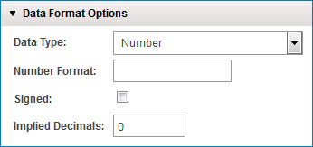

# Number data type

<head>
  <meta name="guidename" content="Integration"/>
  <meta name="context" content="GUID-25bd3c61-4613-42cb-9282-b16756fa47fa"/>
</head>

Among other uses, you can format numeric values for decimal precision, thousands separators, and currencies.

The following table describes the syntax of a numeric pattern string. In this pattern, all ASCII letters are reserved as pattern letters:

|Symbol|Meaning|
|------|-------|
|0|A single digit \(zero will display\)|
|\#|A single digit \(zero will not display\)|
|.|Decimal point|
|,|Comma|
|-|Minus sign|
|E|Used in scientific notation.|
|%|Display as a percent \(divides by 100\)|
|'|Escape character|
|$ \(or other currency symbol\)|May need to use Unicode value \(e.g., "\\u00A4"\) for some characters|

Here are some examples of numeric pattern strings.

|Input|Format Pattern|Output|
|-----|--------------|------|
|123456.789|\#\#\#,\#\#\#.\#\#\#|123,456.789||123456.789|\#\#\#.\#\#|123456.79|
|123.78|000000.000|000123.780|
|12345.67|$\#\#\#,\#\#\#.\#\#\#|$12,345.67|

In addition to formatting patterns, there are two additional settings for handling numeric data. These situations are most commonly found with legacy systems such as AS/400.

**Name**   
**Description**

**Number Format**   
A standard Java number formatting string specifying the format for the value.

**Signed**   
Check if data uses "signed values". Some legacy systems, particularly IBM mainframes using COBOL, denote positive/negative numbers with a special character that replaces the last digit. This option should not be checked for values that simply have a +/- symbol.

**Implied Decimals**   
Often in fixed-length legacy files, numeric values do not have decimal points so the decimal precision can be determined only by an assumed number of decimal digits. The effect of this setting in a process on a given value is dependent upon the context in which the profile that contains the data element is used.