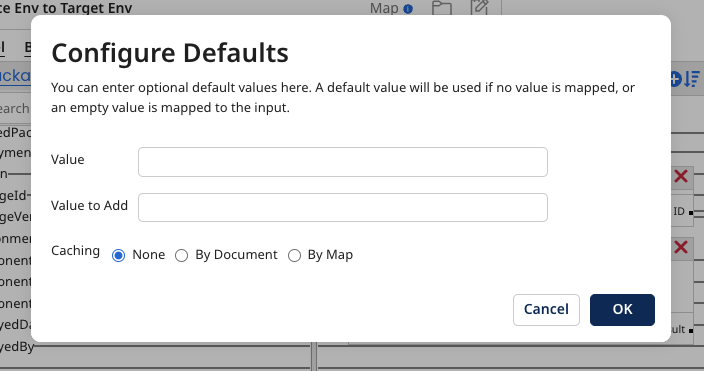

# Numeric functions

<head>
  <meta name="guidename" content="Integration"/>
  <meta name="context" content="GUID-9b70e31b-a97d-444e-b638-5a004a66b9ee"/>
</head>

Numeric functions are a type of map function. To add a numeric function to a map, click the plus icon in the Functions column. In the Add a Function dialog, select **Numeric** for the **Category** and then the type of numeric function that you want to add. You can select from the following types of numeric functions:

| Name | Parameters/Fields  | Description   |
| --- | --- | --- |
| Math Absolute Value | • Value: Input  | Absolute value of a number. |
| Math Add | • Value: Input • Value to Add | Add one value to another value. |
| Math Subtract | • Value: Input • Value to Subtract | Subtract one value from another value. |
| Math Multiply | • Value: Input • Value to Multiply  | Multiply one value by another value. |
| Math Divide | • Value: Input • Value to Divide | Divide one value by another value. |
| Math Ceil (Ceiling) | • Value: Input | Round the value up to the nearest whole number. For example, 1.2 to 2.0. |
| Math Floor| • Value: Input  | Round the value down to the nearest whole number. For example, 1.9 to 1.0. |
| Math Set Precision | • Value: Input • Number of Precision: Number of decimal places | Set the number of decimal places for the value. |
| Number Format | • Number String: Input • Input Mask: Source format • Output Mask: Destination format | Reformat the value by specifying a numeric format. You can avoid using a Number Format function by configuring the source and destination profile elements to be a Number type and specifying the format. |
| Running Total | • Value to Sum: Input | Maintains a running total of the values passed into it. The incremental total is output per destination "detail" instance.  |
| Sum | • Value to Sum: Input • Reset Value: Value used to reset sum. | Calculates a sum based on a particular "Reset Value". For each unique value of the "Reset Value", a sum is calculated. The total is aggregated and output only once per destination "header" instance, per "Reset Value". For example, use the Sum function to add up a number of order line amounts and map out the order total to a header or summary field. |
| Count | • Field to Count: Input • Reset Value: Input  | Works similarly to the Sum function but increments based on the presence of a static value. By default, it increments by 1 each time for each source input and output one final value.  |
| Line Item Increment | • Increment Basis: The value by which to increment • Reset Value: The value at which you want the line item increment to reset | Built-in counter that automatically increments for each occurrence of a source record. The result is output per destination "detail" instance. For example, use the Line Item Increment function to output the line number for each order line.  |
| Sequential Value       | • Key Name: An arbitrary, unique name for the counter. • Fix to Length: The length of the sequential value to be returned. The value is padded with zeros (0's) to the specified length. • Batch Size: Number of sequential values to "reserve" in memory (default is 1). | Built-in counter that automatically increments for each occurrence of the source record. The Key Name entity stores the latest value so future process executions continue to increment by 1 from the last result. Each counter is an ever-increasing value. Counter values are stored per Atom. If a given process is deployed to a different Atom, the next sequential value is different. |

After you've added the function, you can enter optional default values in the Configure Defaults dialog. The following example shows the dialog for a Math Add function:

The Configure Defaults dialog varies depending on which type of numeric function you want to add to the map.
