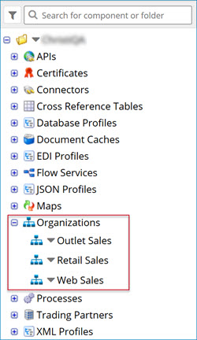
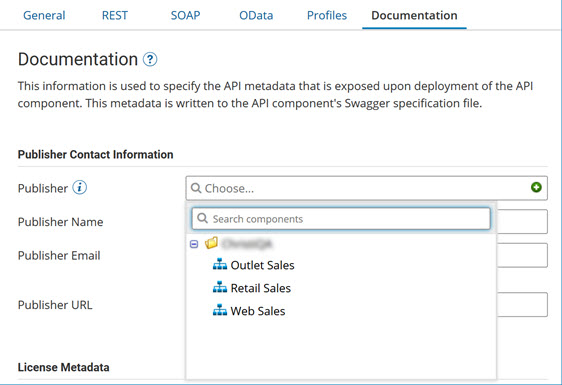
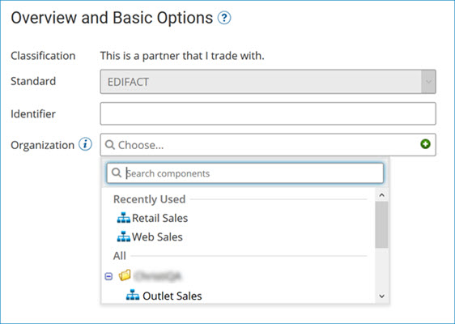

# Organization components 

<head>
  <meta name="guidename" content="Integration"/>
  <meta name="context" content="GUID-405B64DA-8E95-4237-88C1-861869556962"/>
</head>

Use the Organization component to store contact information in a reusable component, rather than on the Documentation tab for each individual API Service/Proxy component or the Contact Info tab for each individual Trading Partner component.

By referencing an organization, you can change or update names and addresses in one place instead of within multiple APIs or Trading Partners. You can create organizations on the Build tab by clicking **Create New** and selecting **Organization** from the drop-down list.

Like other components, you can also search for and locate organizations in the Component Explorer. There you can also copy, clone, and delete organizations as well as show where they are used.

## Organization component usage

You can set the Organization component on the Documentation tab of the API Service/Proxy component or the General tab of the Trading Partner component.

To attach an organization to an API, open the correct API Service/Proxy component. On the Documentation tab, click the **Publisher** field and select the appropriate organization. From there, you can also edit the organization by clicking on the edit icon.

To attach an organization to a Trading Partner, open the correct Trading Partner component. On the Overview tab, click the **Organization** field and select the appropriate organization. From there, you can also edit the organization by clicking on the edit icon.

