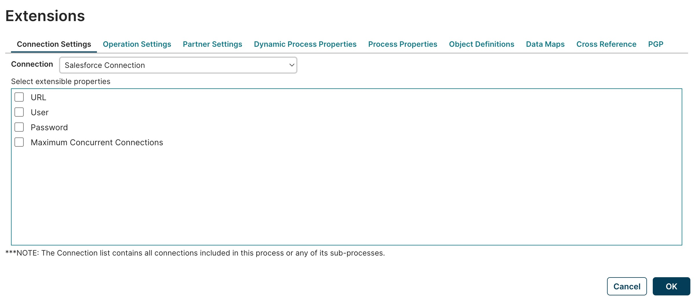

# Process Extensions dialog

<head>
  <meta name="guidename" content="Integration"/>
  <meta name="context" content="GUID-0e173ba6-8b75-46a7-a526-48b9b3bd0c43"/>
</head>

Use the Process Extensions dialog to define extensions for components referenced in the process.

Click the **Extensions** link above the process canvas to open the Extensions dialog.

:::note

For information about the impact of using extensions in parent/child processes, see the [Process extensions topic](./c-atm-Process_extensions_75b3842c-67d8-4baa-9884-1e62e829052a.md).

:::

**OK**   
Applies the extension definitions set on the tabs and closes the dialog.

**Cancel**   
Closes the dialog without defining extensions.

## Connection Settings tab

**Connection**   
Sets the Connection component for which to define extensions using the check boxes below.

Turning on a check box adjacent to the name of an extensible setting defines an extension for that setting.

## Operation Settings tab

**Listen Operation**  
Sets the Listen operation for which to define extensions using the check boxes below.

Turning on a check box adjacent to the name of an extensible setting defines an extension for that setting.

## Partner Settings tab

All settings available to a “My Company” partner can be overridden. However, for “My Trading Partner” partners, certain communication method settings only become available if that Trading Partner component is *not* set to use the default values. All settings available to a Communication Channel can be overridden if the “My Trading Partner” partner is set to use Shared Communication settings.

**Component Type**   
Selects the type of component — Trading Partner or Communication Channel — for which to define extensions.

**Component Name**   
Sets the component for which to define extensions using the check boxes below.

-   If the selected **Component Type** is Trading Partner, the selection options are the account’s Trading Partner components.

-   If the selected **Component Type** is Communication Channel, the selection options are the account’s Communication Channel components.

**Extension Set**   
Sets the extension set — a category of settings — for which to define extensions using the check boxes below. The extension sets available for selection for a Trading Partner component vary depending on the EDI standard upon which the Trading Partner is based and the communications methods supported for that standard.

Turning on a check box adjacent to the name of an extensible setting defines an extension for that setting.

## Dynamic Properties tab

The controls on this tab are used to define extensions for dynamic process properties.

**Dynamic process properties list**   
Lists dynamic process properties for which extensions are defined. To remove a dynamic process property from the list you must first select it.

 Add Dynamic Process Property   
Opens the New Dynamic Process Property dialog for the purpose of defining an extension for a dynamic process property:

-   **Name** — Sets the dynamic process property for which to define an extension. The value typed here must match the name of a dynamic process property configured in a Set Properties step in the process.

-   **OK** — Adds the named dynamic process property to the dynamic process properties list and closes the dialog.

-   **Cancel** — Closes the dialog without adding to the dynamic process properties list.

 Delete Dynamic Process Property   
Initiates a request to remove the selected dynamic process property from the list of dynamic process properties for which extensions are defined. In the confirmation dialog:

-   Clicking **OK** executes the operation.

-   Clicking **Cancel** cancels the request.

## Process Properties tab

**drop-down list**   
Sets the process property component for which to define extensions using the check boxes below.

Turning on a check box adjacent to the name of an extensible property defines an extension for that property.

## Object Definitions tab

**Object Definitions**   
Lists existing object definitions and their component profiles.

For each object definition, the following controls are available:

-   ** Edit Aliases** — Opens the Aliases dialog for the purpose of setting aliases:

    -   Element list — Turning on a check box adjacent to an element name causes a field to appear into which to type the alias.

    -   **OK** — Sets aliases and closes the dialog.

    -   **Cancel** — Closes the dialog without setting aliases.

-   ** Edit User Defined Object Definition** — Opens the User Defined Object Definition dialog for the purpose of modifying the object definition. The controls in the dialog are described below — see **Add Object Definition**.

-   ** Delete User Defined Object Definition** — Initiates a request to delete the object definition. In the confirmation dialog:

    -   Clicking **OK** executes the operation.

    -   Clicking **Cancel** cancels the request.

For each component profile, the following controls are available:

-   ** Choose Locked Fields for Profile** — Opens the Locked Fields dialog for the purpose of locking fields to prevent them from being customized.

    -   Element list — Turning on a check box adjacent to an element name selects that field for locking.

    -   **OK** — Locks the selected fields and closes the dialog.

    -   **Cancel** — Closes the dialog without locking fields.

-   ** Choose Content Root for Profile** \(XML profiles only\) — Opens a dialog for the purpose of setting the content root for the profile.

    -   Element list — Clicking an element name selects it to be the content root.

    -   **OK** — Sets the content root and closes the dialog.

    -   **Cancel** — Closes the dialog without setting the content root.

**Unused Profiles**   
Lists profiles referenced in steps in the process that are available for use in an object definitions. A given profile cannot be used in multiple object definitions.

**Add Object Definition**   
Opens the User Defined Object Definition dialog for the purpose of creating an object definition:

-   **Name** — Sets the name of the object definition.

-   **Object Type** — Sets the type of object.

-   **Selected Profiles** — Turning on a check box adjacent to the name of a profile selects that profile for inclusion in the object definition.

-   **OK** — Creates the object definition and closes the dialog.

-   **Cancel** — Closes the dialog without creating an object definition.

## Data Maps tab

**Data Maps \(Select Extensible Maps\)**   
Lists pairs of source and destination object definitions and for each pair the extensible map components. Turning on a check box adjacent to the name of a map component enables extensions for that map.

For each source object definition, the following control is available:

-   ** Choose Locked Fields for Source Profile** — Opens the Locked Fields dialog for the purpose of locking source profile fields to prevent them from being customized.

For each destination object definition, the following control is available:

-   ** Choose Locked Fields for Destination Profile** — Opens the Locked Fields dialog for the purpose of locking destination profile fields to prevent them from being customized.

The controls in the Locked Fields dialog are described in the **Object Definitions** Tab section above.

Maps without Object Definitions   
For reference purposes, lists map components in the process that use a profile\(s\) which are not included in an object definition.

## Cross Reference tab

Turning on a check box adjacent to the name of a Cross Reference Table component defines an extension for that Cross Reference Table.

## PGP tab

Turning on a check box adjacent to the name of a PGP Certificate component defines an extension for that PGP Certificate.