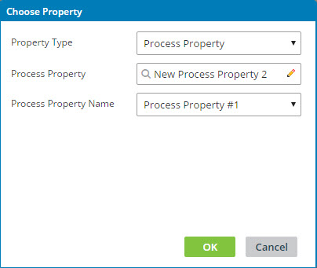

# Process Property component configuration

<head>
  <meta name="guidename" content="Integration"/>
  <meta name="context" content="GUID-35403713-39a4-4fa1-b048-2b7b4e8d656c"/>
</head>

Process Property components are one type of process property. They are reusable components that can consist of a collection of properties.

Process Property components can be created in the same way that you create other types of components: from the Build page’s **Create New** button or Component Explorer, or from any process step that contains an icon for creating a new component . When you create a Process Property component you can add one or more properties to it. You can place the properties in a specific order. For each property within a Process Property component you define its data type, whether it should be persisted, a descriptive label, help text, and a default value. If the property is of the Number or String data type, you also can set allowed values.

**Name**   
**Description**

**Add Property, Delete Property**   
Icons used to add and delete properties from the Process Property component.

**Key**   
Unique ID for a property in the Process Property component. If you are using custom scripting to access a Process Property component, you need this key.

**Data Type**   
Used to select a data type for the property: Boolean, Date, Hidden, Number, or String. The selected data type ensures that when you manually enter data in the Default Value field or in the Extensions dialog on the Atom Management page, it is of the correct data type.

:::note

Process property values of data type Hidden are not visible in the UI. Hidden process properties should not be used to store passwords, however, because their values are not encrypted.

:::

**Persist**   
If selected, the property value is persisted across subsequent executions.

**Label**   
Used to enter a descriptive name for the property. The properties do not have to have unique labels because each property has a unique key. The label appears in the list in this component, the Choose Property dialog, and the Extensions dialogs.

**Help Text**   
\(Optional\) Used to enter text indicating the intended use for the property. The help text appears in the Choose Property dialog and in the Extensions dialog on the Atom Management page.

**Default Value**   
\(Optional\) Used to enter a default value for the property. This default value is used if there is no persisted value stored for the property. This field is:

-   A check box for the Boolean data type \(On = True and Off = False\).

-   A field in which you can enter a value for the Date and Password data types.

-   A list for the Number and String data types. The list displays the allowed values that you add.

**Allowed Values**   
\(Available only for the Number and String data types\) Used to build a list of values for the property. Create this list if you want to restrict users to only these values. These values are used in process extensions.

Above the list are icons for adding, editing, deleting, and moving up and down the allowed values that you add. When adding an allowed value you must supply a value, which appears in parenthesis following the label in the list. If you do not supply a label, the contents of the Value field also appear in the Label field.

There is no limit to the number of properties that you can add to a Process Property component, and there is no limit to the number of Process Property components that you can add. The Process Property components that you add appear in the Component Explorer in the Process Properties category.

Process Property components are easy to find and reuse because you can choose them in the Choose Property dialog. You do not need to remember and type their names manually, like you do when using dynamic process properties.

