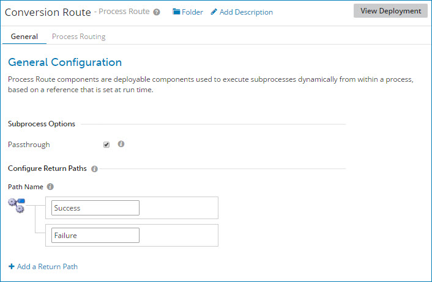

# Process Route dialog, General tab

<head>
  <meta name="guidename" content="Integration"/>
  <meta name="context" content="GUID-2da80f08-4302-4ddd-8a3f-8a923e9b1395"/>
</head>

General configuration of a process route component is performed in the component configuration dialog’s **General** tab.

**Name**     
**Description**

**Subprocess Options**  
 The type of subprocess to be called.

**Passthrough**  
 If selected, documents are passed through to a subprocess for further processing. The subprocess that is called must be defined as a passthrough process \(Data Passthrough is selected in its Start step dialog\).

If cleared, documents are not passed into a subprocess. Any type of subprocess can be called.

**Configure Return Paths**  
 \(Optional\) One or more return paths for the process route.

Whether or not you define any return paths, the process route establishes a Default path for documents that do not match any of the specified route keys.

:::note

Path names are displayed in the order in which you define them. This order does not affect the order in which they will be executed. The return path execution sequence is controlled by the Process Route step.

:::

**Path Name**  
The name of a return path.

The default is Untitled Path. If you specify your own path name, the name is validated as you type.

Return path names must adhere to the following rules:

-   Names must be unique within the Process Route component.

-   Wildcard characters are not supported.

-   Names are case-sensitive \(“a” is different from “A”\).

-   A name cannot be blank and cannot contain leading or trailing white space.

-   A name can include white space within the string \(such as "Good Path"\).