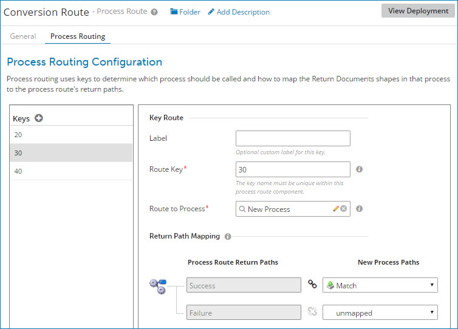

# Process Route dialog, Process Routing tab

<head>
  <meta name="guidename" content="Integration"/>
  <meta name="context" content="GUID-8a3c56b9-fe7f-431d-b050-163460001f8d"/>
</head>

Process routing configuration is performed in the Process Route component’s **Process Routing** tab.

**Name**   
**Description**

**Label**
:   \(Optional\) User-defined name to describe the route key.

**Route Key**  
  One or more unique route keys to be used at run time as the basis for determining which subprocess to call. The keys that you specify should correspond to a calculated route parameter in the Process Route step.

The default key name is Untitled Key. If you specify your own key name, the name is validated as you type.

Key names must adhere to the following rules:

-   Names must be unique within the Process Route component.

-   Wildcard characters are not supported.

-   Names are case-sensitive \(“a” is different from “A”\).

-   A name cannot be blank and cannot contain leading or trailing white space.

-   A name can include white space within the string \(such as "Account Key"\).

Route keys are processed in the order in which they are defined.

**Route to Process**  
  For each route key, the subprocess to be called.

**Return Path Mapping**  
 For each route key, you should map the return paths that you define on the **General** tab to Return Documents steps in the subprocess being called.

The number of Return Document steps in the called process and their names do not have to match the return paths that you define for this Process Route component.

A Process Route component expects data to be returned on every return path that you define for a given subprocess. However, you can leave a return path unmapped if you do not expect a given path in the subprocess to return data.

:::note

You cannot map the same Return Documents step to more than one return path.

:::