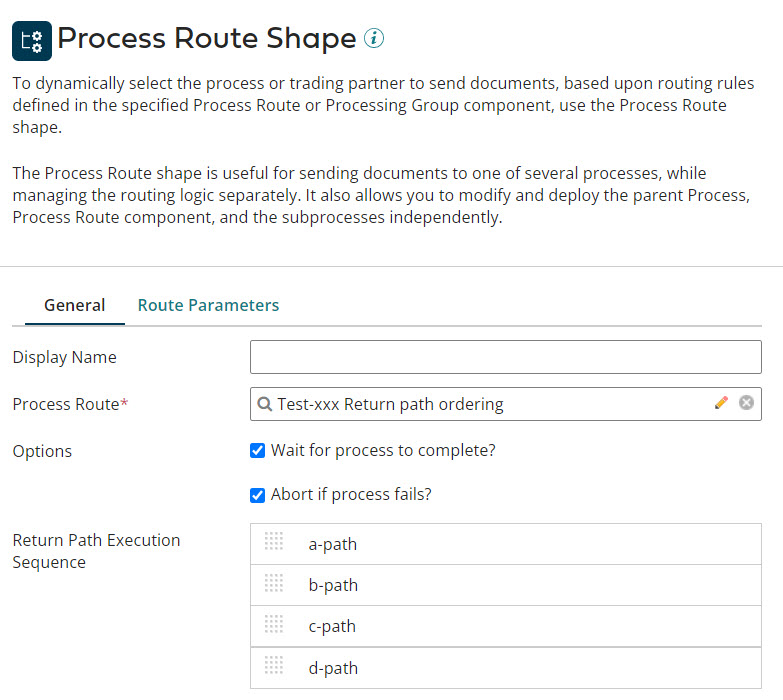
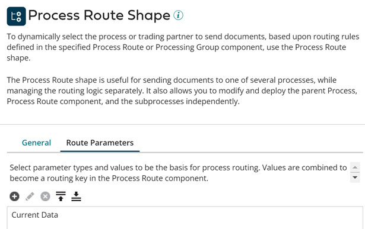

# Process Route step

<head>
  <meta name="guidename" content="Integration"/>
  <meta name="context" content="GUID-B343FB9D-969A-433F-B433-970768D8C6A6"/>
</head>

The Process Route step allows you to select an execution path dynamically at run time based on some value, such as a document property, data profile, extension value, or trading partner.

:::note

- This step is part of the Advanced Workflow and is available only in the Professional and Enterprise Editions of Integration. For more information, contact your account representative.

- If a process route step is included in a process then that packaged component cannot be shared with Integration Pack, Process libraries, or Bundles.

:::

The Process Route step can be thought of as combining the functionality of the Route step and multiple Process Call steps, with the added benefit of dynamic resolution at run time. This combination can simplify process design by:

-   reducing the number of paths, subprocesses, and steps you have to manage

-   providing a single point for managing multiple subprocesses

An additional benefit of the Process Route step is deployment flexibility—the ability to deploy the parent process, the Process Route or Processing Group component, and the subprocesses independently. Because the Process Route or the Processing Group component and its subprocesses are not dependent components, the deployment process might require some additional coordination. At execution, paths are executed according to the order specified in Return Path Execution Sequence field.

## Using the Process Route step

**If the Process Route step that is routed by a Process Route calls a passthrough process**   
\(Passthrough is turned on in the Process Route component\), incoming documents are grouped by process route key. The process associated with that key, as defined in the Process Route component, is called once for all documents that match the key. If the process being called is not a passthrough process, the Process Route step is executed once for each document that reaches it.

**The Process Route step that is routed by a Processing Group must call a passthrough process.**   
Incoming documents are grouped by either partners or documents. If all your trading partners use a standard structure, the routes should be structured on documents. Then, the few partners that do not use a standard document format can call a different process. If the documents do no use a standard structure, the routes should be structured on partners. When the route is structured on partners, individual trading partners can be set to use their own process and individual Document Standards and Document Types can be set to use other processes instead of the default.

If you want to use process extensions in a process that uses the Process Route step, keep the following in mind:

-   Extensions that you define in the parent process are applied only to the parent process.

-   Extensions that you define in a subprocess are applied only to that subprocess.

For example, if you use the same Connector component in the parent process and one of the subprocesses, you need to define the extension in both the parent process and the subprocess.

:::note

Process properties are an exception to this behavior because they have execution scope, meaning that once a property is accessed or set it remains in effect for the duration of the current process execution. With a Process Route step, once a process property value is accessed or set, all default or extended values for that property in any process or subprocess are ignored. The only way to change that process property is with:

-   the Set Properties step

-   the Set Process Property map function

-   a custom scripting step or custom scripting map function

:::

## Process Route step dialog, General tab

**Display Name**   
User-defined name to describe the step. If one is not entered, no label appears on the step.

**Route By**   
Identifies if you are routing by Process Route or Processing Group.

**Process Route**   
Identifies the process route component that you want to call.

You can select an existing component or create a new one. You can also open an existing component for editing.

**Processing Group**   
Identifies the Processing Group component that you want to call.

You can select an existing component or create a new one. You can also open an existing component for editing.

**Wait for process to complete**   
-   If selected, the parent process waits for the subprocess to complete before continuing to its next step. If the subprocess fails, the parent process stops.

-   If cleared, and if **Abort if process fails** is selected, the parent process reports any subprocess errors after all subprocesses have executed.

If the process that is being called is a passthrough process \(Data Passthrough is selected in its Start step dialog\), this check box is turned on and cannot be turned off.

**Abort if process fails**   
If selected, the parent process stops and is marked as failed.

**Return Path Execution Sequence**   
For processes routed by the Process Route, determines the order in which return paths are executed.

The return paths that are defined in the selected process route component are listed. You can change the order in which return paths are executed by dragging and dropping reorder icons \(  \) up or down in the list.

The Default path for the process route component is always executed last.

## Process Route step dialog, Route Parameters tab 

The Route Parameters tab is only available if **Process Route** is selected in the **Route By** field on the General tab.

**Parameter Value**   
Identifies the parameter types and values that are the basis for process routing.

The parameter values that you specify are combined to become the route key in the Process Route component. Route keys are used to determine which subprocess to call.