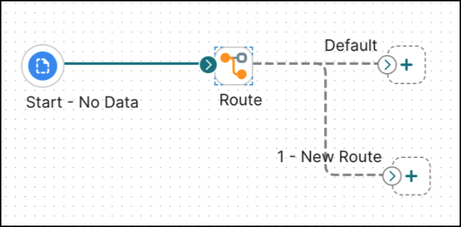

# Route step

<head>
  <meta name="guidename" content="Integration"/>
  <meta name="context" content="GUID-65B7219A-3D2B-4A4E-9679-F12722139B61"/>
</head>

The Route step conditionally sends documents through different execution paths based on the value of a specified field. This field can be extracted from either a document property or a data profile. You can add multiple conditions and values to the Route step allowing for many different execution paths.

As documents enter the Route step, the Route By value is obtained and then compared against the defined route values in sequential order. When a match is found, the document is routed down that path. If the Route By value does not match any of the route values, the document is routed down the default path.

For example, if the Route step value matches the value defined for *1-New-Route*, the document will be routed to that path. If it does not match, it will be routed to the *Default* value. 

Route step paths are executed in sequence according to how they are ordered in your step's configuration. Default routes are always executed last.

## Route step dialog

- **Display Name** - User-defined name to describe the step. If one is not entered, “Route” appears on the step.

- **Route By** - Choose the type of value to route by. See the [Parameter Values](../Process%20building/c-atm-Parameter_Values_23a1eb13-d83b-423e-adf1-d78db4a1fbbd.md) topic for more information.

- **Route Values** - One or more conditions to compare to the Route By value.

- **Comparison** - Used to select one of the following comparison operators: Equal To, Not Equal To, Greater Than, Greater Than or Equal To, Less Than, Less Than or Equal To, Matches [Java Regular Expression](https://docs.oracle.com/javase/8/docs/api/java/util/regex/Pattern.html), Matches Wildcards.

  Use Matches Wildcards to match a value on a single line input. To match a value in a multi-line input, use Matches Regular Expression.

  An asterisk (*) is used with Matches Wildcards as a wildcard to match one or more occurrences of any character. A question mark (?) is used to match a single occurrence of any character.

- **Value** - Value to compare the Route By value to, using the comparison operator.
