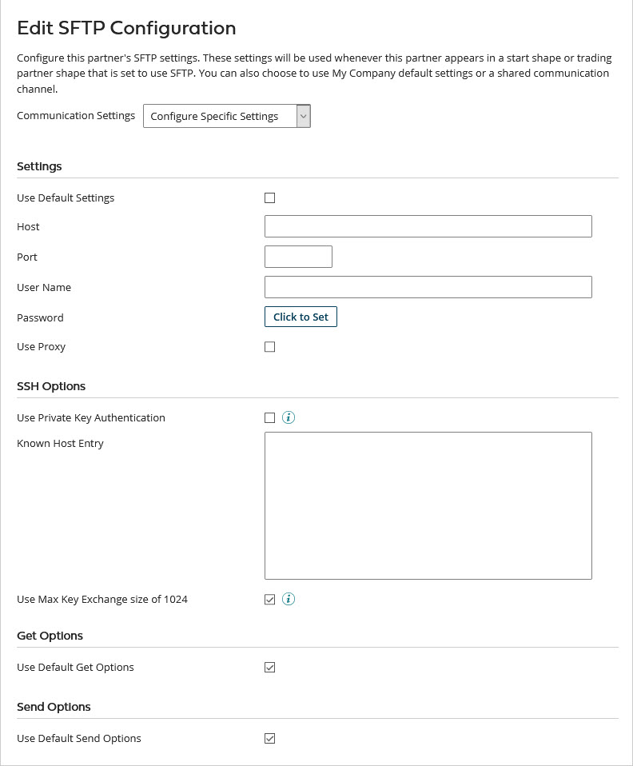
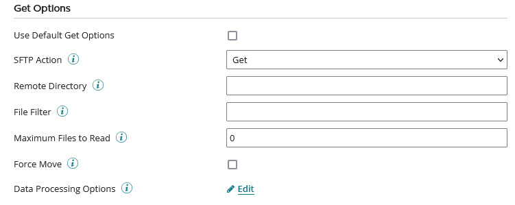
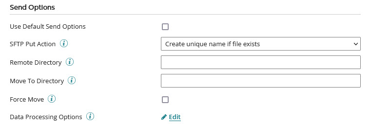

# SFTP Communication Method configuration 

<head>
  <meta name="guidename" content="Integration"/>
  <meta name="context" content="GUID-be47b33e-2fda-4974-b049-375a6df57ce0"/>
</head>

To set up SFTP as a communication method for a trading partner, you can use default settings, shared communication, or manually configure specific settings in the Edit SFTP Configuration dialog. The dialog opens from within the trading partner **Communication** tab when you add SFTP as a communication method or click **SFTP** in the Communication Method list.

## Settings 

**Name**  
**Description**

**Use Default Settings**  
If selected, the settings in this section and the SSH Options section are not visible; this partner uses the settings configured for whichever My Company that it is paired with on a Start or Trading Partner step.

**Host**  
The domain name or IP address of the SFTP host.

**Port**  
The command port on which the SFTP server listens for incoming connections from an SFTP client. The default port is 22.

**User Name**  
The user name of the account on the SFTP server.

**Password**  
The password of the account on the SFTP server.

## SSH Options 

**Name**  
**Description**

**Use Private Key Authentication**  
Using a private key to identify a user is an alternate method for logging onto a server instead of using a password. This method is not available if you are using a Atom Cloud. Examples of private keys are RSA and DSA.

**Client SSH Key File Path**  
Available when Use Private Key Authentication is on. The file system path that specifies the location of the client key file on the running Atom. Store your Client SSH keys in a folder other than the SFTP connector and not in the Atom installation directory folders. These folders may be overwritten during updates.

**Key File Password**  
Available when Use Private Key Authentication is on. The password set by the user to protect the key file.

**Known Host Entry**  
Paste an SSH Known Host key, typically stored in the /home/\[user\]/.ssh/known\_host file, for the connector to verify/match against the associated private key.

**Use Max Key Exchange size of 1024**  
If selected, this field limits the size of the Known Host key, which is typically hundreds of characters long and uses the 0.1.51 algorithm sequence. Use only when the SFTP server does not support key sizes greater than 1024 bits.

## Get Options 

**Name**  
**Description**

**Use Default Get Options**  
If selected, the settings in this section are not visible; this partner uses the settings configured for whichever My Company that it is paired with on a Start or Trading Partner step.

**SFTP Action**  
The SFTP Get actions set what to do when encountering file\(s\) with the same name:

-   Get — retrieves the files from the SFTP server but does not delete them.

 -   Get and Delete — retrieves and deletes the files from the server. recommends that you use this action for executions that are run in production mode to prevent the same file from being processed twice.

 -   Get and Move — retrieves the files from the server. After they are retrieved, the files will be moved to a different directory on the SFTP server which is specified by the Move To Directory field.

**Remote Directory**  
The directory on the SFTP server from which files are read.

**File Filter**  
Reads files conditionally based on a pattern that matches the file name. Use the wildcard characters \* and ? to create file name patterns.

**Maximum Files to Read**  
Sets the maximum number of files to read at once. The default value, 0, reads all matching files in directory.

**Force Move**  
 If selected, the connector's special logic moves files to the designated Move To Directory. If cleared, some SFTP servers allow a move while others return an error.

**Data Processing Options**  
The data processing steps are completed in the order specified after receiving the data before the data is decrypted.

## Send Options 

**Name**  
**Description**

**Use Default Send Options**  
If selected, the settings in this section are not visible; this partner uses the settings configured for whichever My Company that it is paired with on a Start or Trading Partner step.

**SFTP Put Action**  
Sets what the Communication Channel should do after getting an SFTP file and finding that a file with that name already exists:

 -   Create unique name if file exists — keeps the old file and adds the new file with a different name.

  -   Append if file exists — keeps the old file and adds the new data to the end of it.

 -   Error if file exists — keeps the old file without appending or replacing it or adding a new file.

 -   Overwrite if file exists — replaces the old file with the new file.

**Remote Directory**  
Directory on the FTP server to which data is uploaded. If the Move To Directory is not specified, the data is left in the remote directory.

**Move to Directory**  
The directory into which the data moves after it is successfully uploaded.

 recommends that you use this if another application is retrieving files from the Move To Directory. the files are first written to the Remote Directory to avoid the risk that an application might read the files before the upload is completed. After the files are successfully uploaded, they are moved into the Move To Directory.

**Force Move**  
If selected, the connector's special logic moves files to the designated Move To Directory. If cleared, some SFTP servers allow a move while others return an error.

**Data Processing Options**  
The data processing steps are completed in the order specified before the data is sent.