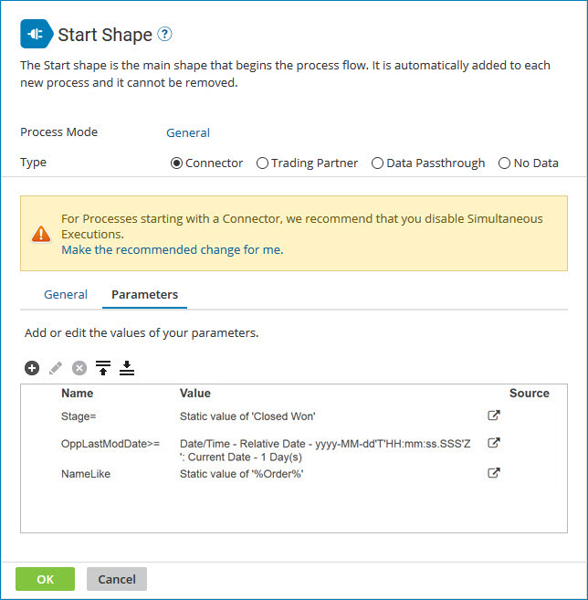

# Start step dialog’s Connector option

<head>
  <meta name="guidename" content="Integration"/>
  <meta name="context" content="GUID-7bf0d00f-7d0c-40bd-a241-450fa9a79c44"/>
</head>

The Connector option is the default and most common option for a Start step. This setting allows you to define an inbound action to bring documents into a process. This option requires that you select a connector from our library.

For some of the application connectors, a unique request message must be sent to the application to bring documents into the process. These cases require defining parameters within the Start step to build this initial request message.

Review the topics links to learn about operation requirements for your integration scenario and to see descriptions of the different options available for start parameter values.