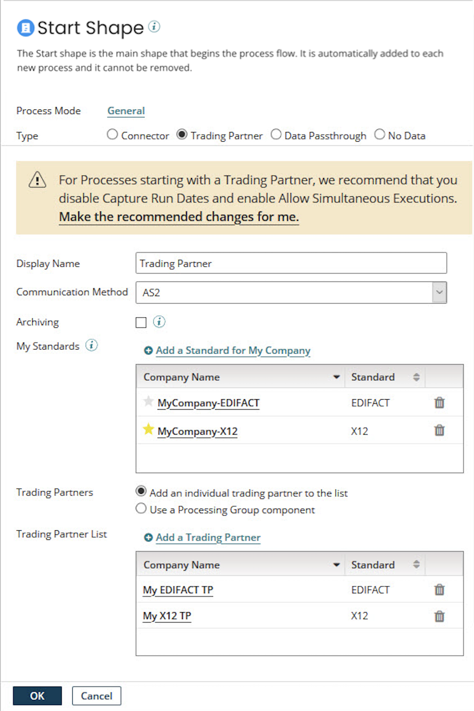

# Start step dialog’s Trading Partner option

<head>
  <meta name="guidename" content="Integration"/>
  <meta name="context" content="GUID-0ddc68ec-862f-45e2-a20b-bb3398e73b4b"/>
</head>

The Trading Partner option is unique to B2B and EDI integration. This setting allows you to receive data using one of the B2B-enabled protocols and process that data as appropriate for any corresponding B2B/EDI standard. For example, you might receive an AS2 message, extract the data, and process it as an X12 EDI transaction. Or, you might receive an HTTP message and process it through the RosettaNet connector.

:::note

The Trading Partner step, EDI, and B2B solutions are in their own Integration edition. To enable these capabilities in your account, contact your Boomi account representative.

:::

The trading partner start step allows you to receive data using one of the B2B-enabled protocols and process that data as appropriate for the corresponding B2B/EDI standard. For example, you might receive an AS2 message, extract the data, and process it as an X12 EDI transaction. Or, you might receive an HTTP message and process it through the RosettaNet connector.

The types of processing done depends on the document standard being traded and configurations found in the trading partner components involved in the transaction. Common functionality includes automatically reconciling inbound acknowledgements with outbound transactions, performing profile-based validation, and generating outbound acknowledgements for the transactions.

Review the [Trading Partner components](r-atm-Trading_Partner_Components_96eb4e6c-f5a6-4583-98a8-690236d288f9.md) help topic to learn how to define your company and trading partners.

Documents, Acknowledgments, and Errors paths are attached to the Trading Partner Start step.

- Attach steps to the Documents path to define the processing to perform on valid documents.

- Attach steps to the Acknowledgments path to define the routing of generated acknowledgment messages.

- Attach steps to the Errors path to define the processing to perform on invalid X12, EDIFACT, HL7, ODETTE, and RosettaNet documents. For EDIFACT, HL7, and ODETTE documents, the Errors path is used only if **Invalid Inbound Document Routing** is set to Errors path for the document type in the Trading Partner Document Types tab.

An Archive path is attached to the Trading Partner Start step if the **Archiving** option is selected. You can define custom archiving logic by attaching steps to the Archive path.

Paths attached to the Trading Partner Start step are executed in the following order:

- Documents

- Acknowledgments

- Errors

- Archive

**Display Name**

(Optional) User-defined name to describe the step. If you do not enter a name, Trading Partner appears on the step. The selected standard, company, and communication method also appear on the label.

**Communication Method**

Used to select a communication protocol:AS2DiskFTPMLLP when HL7 is the standardSFTPHTTPWhen used in the Start step, this selects the communication protocol for inbound data. You can configure one inbound method only per process.

**Archiving**

If you select this option, steps attached to the Archive path define the processing performed to archive the raw document data.

**My Standards**

This list contains “My Company” trading partners for document standards used in the process for inbound data, when used in the Start step, or for outbound data, when used in the Trading Partner step. Click Add a Standard for My Company to add the “My Company” trading partners for any document standards that are needed in the process.
  
If you select the star icon for a “My Company” trading partner (), that trading partner’s settings for the selected Communication Method are the defaults for that communication method. The interchange with each trading partner uses the default communication settings when configuring the default settings. To select a different “My Company” trading partner to provide default communication settings, click its star icon.

Suppose, in the Start step, there are multiple Custom-standard trading partners and "My Company" trading partners. Suppose both types of trading partners use the same communication settings. In that case, you cannot determine a Custom-standard document's intended sending trading partner and receiving "My Company" trading partner. The platform processes the Custom-standard documents but does not report the From Trading Partner and To Trading Partner metadata values in Process Reporting. Reporting of the values occurs if one Custom-standard trading partner and "My Company" trading partner only use different communication settings from other Custom-standard and "My Company" trading partners in the step.

Suppose the selected **Communication Method** is AS2 in a Start step. If multiple "My Company" trading partners use the same standard, and two or more trading partners use the same AS2 ID, a duplicate route error occurs when the listener starts when the step runs.

**Trading Partners**

Used to select trading partners, either individually or in a Processing Group component, with which your company conducts the interchange.
  

  - **Add an individual trading partners to the list** - If selected, Trading Partner List appears below.

  - **Use a Processing Group component** - If selected, Processing Group appears below.

**Trading Partner List**

Lists the trading partner component(s) with which your company conducts the interchange. Click Add a Trading Partner to add trading partner components to the list.

**Processing Group**

Selects the Processing Group component consisting of trading partner components with which your company conducts the interchange. To create a Processing Group, click  Create.

When you set up multiple trading partners in a Start step, all of the trading partners must use the same Communication Method as MyCompany.

**Error Handling Option**

Determines how the process behaves if there is an error in one of the trading partner connections.

  - **Stop Process on Error** (Default) - The process stops executing if one trading partner connection has an error.

  - **Continue Process on Error** - The process continues executing even if one of the trading partner connections has an error.