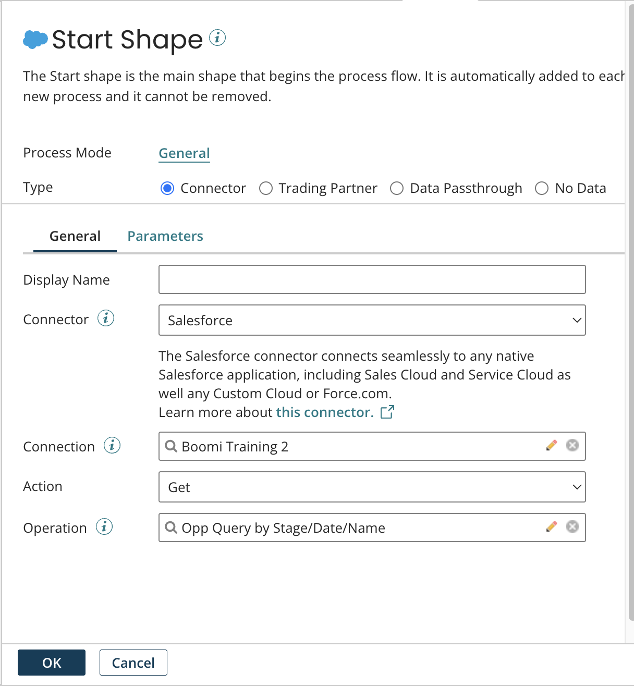
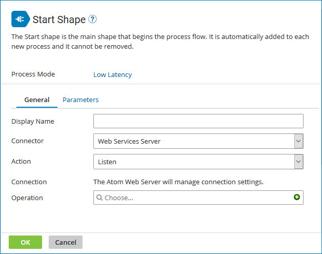

# Start step

<head>
  <meta name="guidename" content="Integration"/>
  <meta name="context" content="GUID-FEAA1F64-652E-437E-B5BE-D129CF805B08"/>
</head>

The Start step is the main step that begins the process flow. It is automatically added to each new process and it cannot be removed. You use the Start step dialog to configure the Start step.

After you create a process, the Start step dialog opens. The Start step dialog looks and behaves slightly differently, depending on whether you have the Services Enablement feature enabled in your account:

- If Services Enablement *is not* enabled in your account — After you configure the Start step dialog, you can click the Options link to open the Process Options dialog.

- If Services Enablement *is* enabled in your account — The process mode is set to General by default. You can click the text to open the Process Options dialog and change the process mode or other options.

If you set the process mode to General, there are multiple configuration options available for the Start step. The option buttons at the top of the dialog allow you to define different start scenarios for your process. A different Start step icon corresponds to each option:

-  Connector - Gets data into the process or sends data out of the process using one of the application or technology connectors.

  :::note

  For many application connectors, the step icon is specific to the application.

  :::

-  Trading Partner - Gets data into the process or sends data out of the process for a specific trading partner and handles common EDI document frameworks such as X12.

  :::note

  The Trading Partner step, EDI, and B2B solutions are in their own Integration edition. To enable these capabilities in your account, contact your Boomi account representative.

  :::

-  Data Passthrough- Gets data into the process from another parent process or another external source.

-  No Data - The process does not receive or retrieve data from any source. Instead, a single empty document is forwarded through the process flow.

If you set the process mode to General, you may see a message containing recommendations about how to set the Allow Simultaneous Executions and Capture Run Dates check boxes, which are process options.

If you set the process mode to Low Latency, the Start step dialog is set to use the Connector option, the Connector field is selectable to either JMS, Listener, MLLP Server, Salesforce Platform Events, or Web Services Server, the Action field is set to Listen, and the Atom Web Server manages the connection settings. You can change only the Connector setting when the process mode is set to Low Latency. The process mode appears in the upper right corner of the dialog.

:::note

A process that uses the Web Services Server connector in the Start step and that existed prior to the *9 January 2013* release will continue to run as it did prior to the release date. A process that uses the JMS connector in the Start step and that existed prior to the *July 2014* release will continue to run as it did prior to the release date. A process that uses the MLLP Server Connector in the Start step and that *existed prior* to *3 June 2015* will continue to run as it did prior to the release date. You will not see a process mode assigned to this process in the **Start step** dialog. If you open the **Process Options** dialog and you did not set the process mode, it defaults to Low Latency and a notification message appears. If you want to set a process mode for the process, select a mode and click **OK** in this dialog. If you want to leave it as is, click **Cancel** in this dialog.

:::

