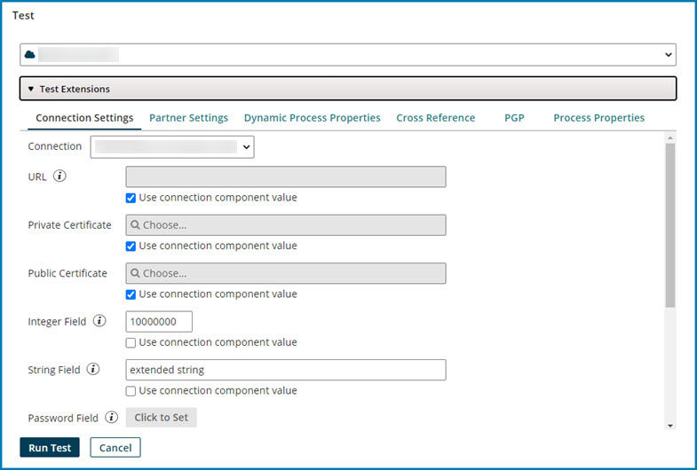

# Test dialog

<head>
  <meta name="guidename" content="Integration"/>
  <meta name="context" content="GUID-f6c46c13-d2ba-457f-a3f8-c37fcd5d046a"/>
</head>

In an open process click **Test** in the Build page to open the Test dialog to run a test execution of the process.

## Select Atom

Sets the Atom on which the process will run. Alternatively, you can run the process on a Test Atom Cloud.

## Test Extensions

The controls in this section are used to set the extension values to be applied to the test execution.

## Connection Settings tab

**Name**

**Description**

**Connection**

Sets the connection to which the following specified extension values apply:

For each extended connection setting, clearing the **Use connection component** value check box enables the adjacent field for setting the extension value. If you select **Use connection component** value, the values configured in the underlying connection component are used at runtime.

:::note

Extended custom properties key-value pairs (fields) appear for the selection in a connection. For example, any blocked key is automatically removed from the connection when saved. Additionally, you can add a maximum of 50 key-value pairs.

:::

## Partner Settings tab

**Name**

**Description**

**Component Type**

Selects the type of component — Trading Partner or Communication Channel — for which to set extension values.

**Component Name**

Sets the component on which the following extension values apply:

- If the selected Component Type is Trading Partner, the options are Trading Partner components.
- If the selected Component Type is Communication Channel, the selection options are Communication Channel components.

**Extension Set**

Sets the extension set to which the following extension values apply:

For each extended setting in the **Field** column, clearing the **Use Default**? check box enables the adjacent field to set the extension value. If **Use Default?** is on, the values configured in the underlying component are used at runtime.

For some extended settings in communications method-based extension sets, to populate the field, click the adjacent magnifying glass icon and browse for a component.

## Dynamic Process Properties tab

For each extended dynamic process property in the **Name** column, the adjacent field sets the extension value.

## Cross Reference tab

**Name**

**Description**

**Cross Reference**

Sets the cross reference table to which the following extension value applies:

**Override**

If selected, controls are available for the purpose of defining the cross-reference table used at runtime. If cleared, it uses the underlying **Cross Reference Table** component, whose contents appear below.

The controls for defining the cross-reference table used at runtime are identical to those used to create and edit a cross-reference table component. The exceptions are omitting the **Update Column Headers** icon, the **Update Table Definition** link, and the Enable Atom-specific values icons. Refer to the Cross Reference Table Components topic linked below for information about defining cross reference tables.

## PGP tab

**Name**

**Description**

**PGP**

Sets the PGP certificate to which the following extension value applies:

**Certificate**

Sets the PGP certificate to use at runtime. To populate the field, click  and browse for the PGP certificate.

**Use Default?**

If cleared, it enables Certificate. If selected, it disables Certificate, which means using the PGP certificate configured in the underlying Certificate component at run-time.

## Process Properties tab

**Name**

**Description**

**Process Property**

Sets the process property component to which the following extension values apply:

For each extended process property in the Field column, clearing the Use Default? check box enables the adjacent field for the purpose of setting the extension value. If Use Default? is on, it uses the configured values in the underlying process property component at runtime.

## Run Test

Starts the test execution of the process on the selected Atom. The dialog closes, and the process canvas background turns gray, indicating the process is in Test mode.

## Cancel

Closes the dialog without starting a test execution.