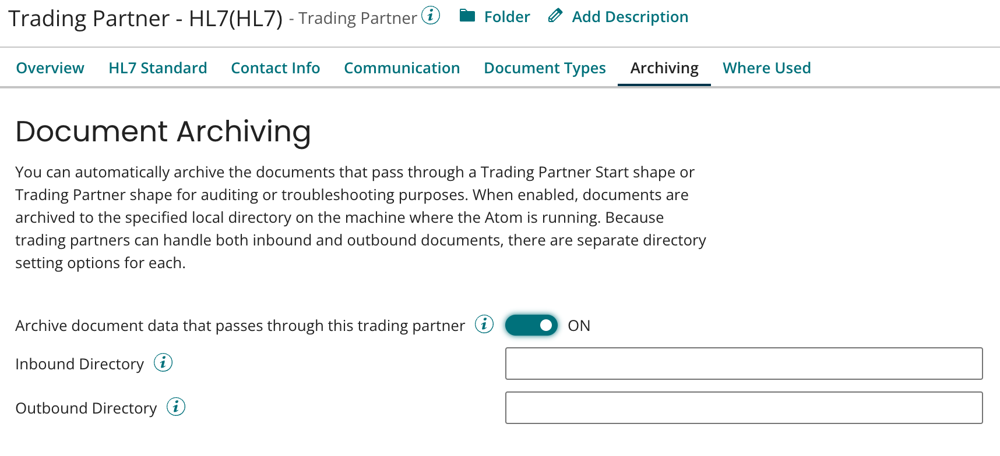

# Trading Partner Archiving tab 

<head>
  <meta name="guidename" content="Integration"/>
  <meta name="context" content="GUID-51782a2d-3992-4e37-a354-3b335fe8d5cb"/>
</head>

Automatically archive documents that pass through a Trading Partner to a specified local directory on the machine where the Atom is running.

The archiving options are similar to connector operation archiving settings. Because trading partner components can handle both inbound and outbound documents, there are separate directory setting options for each.

## Processes in which trading partners share a communication channel 

By default, in a process in which trading partners share a communication channel, the archive directory and filename prefix for documents processed by trading partners sharing the channel are determined as follows:

-   If the Trading Partner Start or Trading Partner step is configured to use a processing group and **Archive document data that passes through this trading partner** is selected in the **Archiving** tab of the first trading partner in the processing group’s routing table, the archive directory is set in that tab and the filename prefix is the name of that trading partner component.

-   If the Start or Trading Partner step is not configured to use a processing group and **Archive document data that passes through this trading partner** is selected in the **Archiving** tab of the first trading partner in the process XML for the step, the archive directory is set in that tab and the filename prefix is the name of that trading partner component.

Regardless of whether the step is configured to use a processing group, if **Archive document data that passes through this trading partner** is not selected for the first trading partner sharing the channel, none of the documents processed by trading partners sharing the channel are archived.

However, if **Archive document data that passes through this trading partner** is selected in the **Archiving** tab of the channel’s Communication Channel component, the archive directory for documents processed by trading partners sharing the channel is set in that tab and the filename prefix is the name of the Communication Channel component. With this option, documents processed by trading partners sharing the channel are archived, regardless of whether **Archive document data that passes through this trading partner** is selected in those trading partners.

## Custom archiving logic as an alternative 

For greater document archiving flexibility than is possible with archiving configured in a Trading Partner or Communication Channel component, you can enable custom archiving logic as follows:

-   For inbound interchanges, select **Archiving** in the Trading Partner Start step.

-   For outbound interchanges, select **Archiving** in the Trading Partner step.