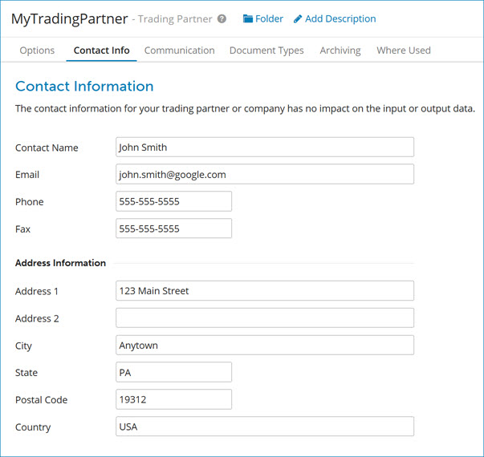

# Trading Partner Contact Info tab 

<head>
  <meta name="guidename" content="Integration"/>
  <meta name="context" content="GUID-d4d7fd69-9726-4382-b797-1c79b20c2bcc"/>
</head>

The Contact Information tab is where you enter your trading partner’s contact info for reference purposes. It has no impact on input or output data.

