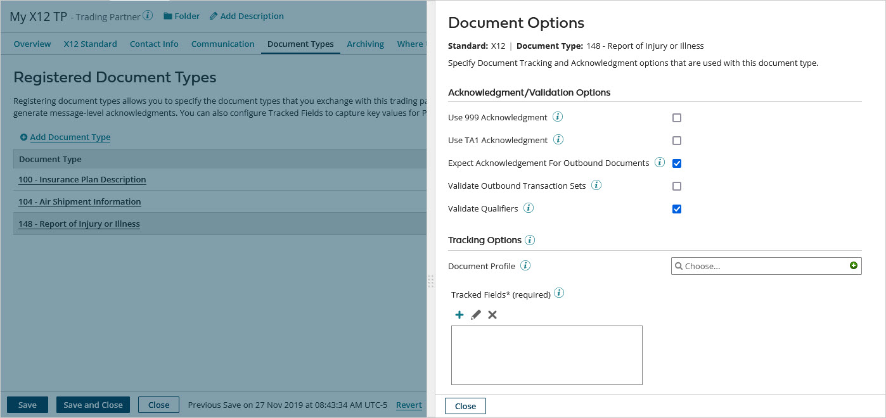

# Trading Partner Document Types tab 

<head>
  <meta name="guidename" content="Integration"/>
  <meta name="context" content="GUID-7cbb75a3-5c45-4ce1-9697-abb546b6e875"/>
</head>

Use the Trading Partner Document Types tab to select the document types you wish to exchange with a trading partner, set acknowledgment and validation options, and configure Tracked Fields to capture key values for Process Reporting

:::note

This tab is visible only for trading partner components classified as “This is a partner that I trade with.”

:::

By configuring document types, data received from the trading partner are validated automatically against the selected profile to generate message-level acknowledgments.

## Registered Document Types 

Used to select a transmission \(document type\). Transmissions are numbered transaction values that specify the data you are trading. The list of available document types is based on the document standard configured for the Trading Partner.

## Acknowledgment/Validation Options 

This section does not apply to Tradacoms document types.

**Name**  
**Description**

**Use 999 Acknowledgment**  
\(X12 only\) If selected, EDI 999 functional acknowledgments are enabled for the selected transaction set. 999 acknowledgments confirm that the file passed standard-level syntax and structure within EDISS \(EDI Support Services\). EDI 999 acknowledgments are similar to EDI 997 acknowledgments, which serve as receipts that generally acknowledge healthcare-related transaction sets \(X12 version 5010 and higher\).

**Use TA1 Acknowledgment**  
 \(X12 only\) If selected, TA1 acknowledgments are enabled for the selected transaction set. TA1 is an interchange-level \(ISA/IEA\) acknowledgment. TA1 acknowledgments have a Transaction Set document property value of “TA1”.

To route TA1 acknowledgment messages to processes:

 -   Clear the **Filter Functional Acknowledgments** check box on the X12 Standard tab in the Basic X12 Options section.

 -   Use the Transaction Set document property to route TA1 acknowledgment messages.

**Expect Acknowledgment For Outbound Documents**
\(Selected by default\) Used to indicate whether an acknowledgment is expected for the EDI document that was sent. You can search for documents with missing acknowledgments in the Process Reporting Document Ack Status column. When on, the Ack Status column is blank until an acknowledgment is received. When cleared, the Ack Status column is automatically populated with "Not Expected."

**Validate Outbound Transaction Sets**  
\(X12 only\) If selected, individual transaction set documents are validated against the selected **Document Profile**. Each document found to have any errors is sent to the step’s Errors path.

:::note

However, if this option is selected and, in the **X12 Standard** tab, **Validate Outbound Interchanges** with the Fail Interchange if Any Documents Have Errors option is also selected, if a document error occurs, the validation outcome is the same as if transaction set-level validation had not been selected: The entire interchange is sent to the step’s Errors path.

:::

 **Validate Outbound Messages**  
If selected, individual EDIFACT and ODETTE messages are validated against the selected **Document Profile**. Each document found to have any errors is sent to the step’s Errors path.

:::note

However, if this option is selected and, in the **EDIFACT Standard** or **ODETTE Standard** tab, **Validate Outbound Interchanges** with the Fail Interchange if Any Documents Have Errors option is also selected, if a document error occurs, the validation outcome is the same as if message-level validation had not been selected: The entire interchange is sent to the step’s Errors path.

:::

If selected and **Validate Outbound Documents** is also selected in the **ROSETTANET Standard** tab, RosettaNet messages are validated against the selected **Document Profile**. Each document found to have any errors is sent to the step’s Errors path.

**Validate Outbound Transmissions**  
\(HL7 only\) If selected, individual messages are validated against the selected **Document Profile**. Each document found to have any errors is sent to the step’s Errors path.

:::note

However, if this option is selected and, in the **HL7 Standard** tab, **Validate Outbound Interchanges** with the Fail Interchange if Any Documents Have Errors option is also selected, if a document error occurs, the validation outcome is the same as if transmission-level validation had not been selected: The entire interchange is sent to the step’s Errors path.

:::

**Invalid Inbound Document Routing**  
\(EDIFACT, HL7, and ODETTE only\) Used to choose the Start step path to which invalid inbound documents are routed — the Documents path or the Errors path. The Errors path is the default.

:::note

You may wish to maintain the existing behavior of an existing process that uses this document type in which invalid inbound documents are routed to the Documents path. If you update the settings for the document type, be sure to select the Documents path if it is not already selected.

:::

**Validate Qualifiers**  
\(X12, EDIFACT, HL7, and ODETTE only\) If selected \(the default\), qualifiers in documents are validated.

## Tracking Options 

**Name**  
**Description**

**Document Profile**  
 Identifies the EDI profile that represents the inbound/outbound data structure for the selected transmission. Required for field-level validation and acknowledgment handling.

**Tracked Fields**  
Allows for custom field tracking in Process Reporting for the selected transmission.