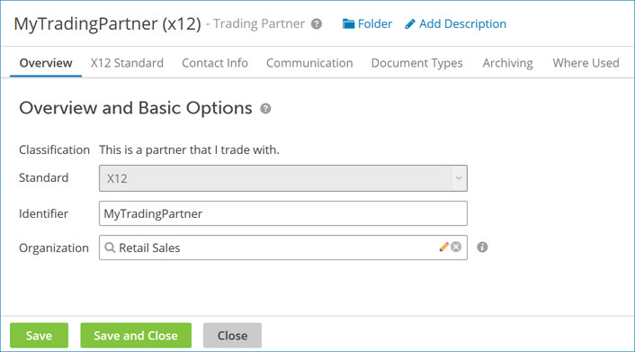

# Trading Partner Overview tab 

<head>
  <meta name="guidename" content="Integration"/>
  <meta name="context" content="GUID-637898B8-5589-4943-9805-1921D3C34C03"/>
</head>

The overview tab shows the selected standard, which cannot be changed and is where you set the identifier and organization.

**Name**  
**Description**

**Classification**  
Identifies the role of this Trading Partner component in Trading Partner steps as either your company \(“This is my company.”\) or a trading partner of your company \(“This is a partner that I trade with.”\). This option is set when you create the component.

**Standard**  
Identifies the EDI standard applicable to this Trading Partner component. This option is set when you create the component.

 -   X12 — Accredited Standards Committee \(ASC\) X12 standard

 -   EDIFACT — UN/EDIFACT \(United Nations/Electronic Data Interchange For Administration, Commerce and Transport\) standard

 -   HL7 — HL7 \(Health Level Seven International\) standard

 -   ODETTE — ODETTE \(Organisation for Data Exchange by Tele Transmission in Europe\) standard

 -   CUSTOM — User specified standard

 -   ROSETTANET — ROSETTANET 1.1 and 2.0 standard

   -   TRADACOMS — The UK-based standard

**Identifier**  
Sets the generic identifier for this component. If you are setting **Standard** to X12 or EDIFACT, consider setting this identifier to be the same as one of the following values to ensure uniqueness:

 -   X12 — **Interchange Standard ID \(ISA11\)**

 -   EDIFACT — Interchange Sender/Receiver \(UNB02/03\) **ID**

 -   ODETTE — Interchange Sender/Receiver \(UNB02/03\) **ID**

**Organization**    
Sets a predefined organization for the trading partner that is used to organize settings, such as multiple document standards for the same organization, and share common information, such as common contact information, for the organization.

In this field, specify an Organization component that has previously been created and defined or create a new Organization component.