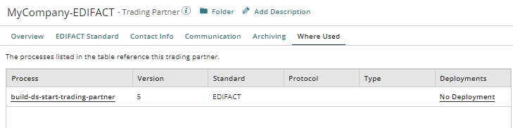

# Trading Partner Where Used tab 

<head>
  <meta name="guidename" content="Integration"/>
  <meta name="context" content="GUID-8d0d57e7-f18f-4930-b90a-60913e638372"/>
</head>

The Trading Partner Where Used tab shows the processes that reference the selected trading partner.

You can open the process to view or edit it by clicking the process name. Also, you can view the process deployment that contains the trading partner by clicking the link in the **Deployments** column to open the Deploy Processes page. If the link text reads **View Deployment**, the latest version of the process is deployed. If the link text reads **No Deployment**, the process is not deployed.