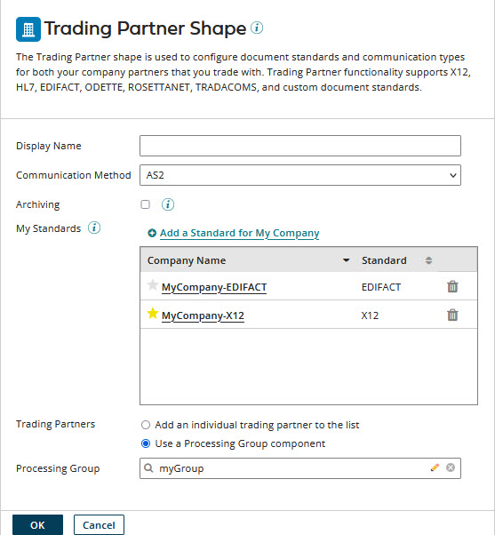

# Trading Partner step

<head>
  <meta name="guidename" content="Integration"/>
  <meta name="context" content="GUID-261D786C-F10F-4654-A7B9-DB278FCB8271"/>
</head>

Use the Trading Partner step to configure document standards and communication types and to identify your company and your trading partners.

Enable a trading partner using one of these methods:

-   For inbound data processing, select Trading Partner in a process’s Start step.

-   For outbound data processing, from the steps palette’s Connect tab under General, select the Trading Partner step and drag it onto the canvas.

An Errors path is attached to the Trading Partner step.

-   If outbound validation is configured in the trading partner component, attach steps to the Errors path to define the processing to perform on invalid documents.

-   If outbound validation is not configured in the trading partner component, simply attach a Stop step to the Errors path.

An Archive path is attached to the Trading Partner step if the **Archiving** option is selected in the Trading Partner step dialog. You can define custom archiving logic by attaching steps to the Archive path.

For an outbound Trading Partner, the Errors path is executed first followed by the Archive path. For inbound Trading Partners \(like in the Start step\), the Documents path is executed first followed by the Acknowledgments, Errors, and Archive paths respectively.

:::note

The Trading Partner step, EDI, and B2B solutions are in their own Integration edition. To enable these capabilities in your account, contact your Boomi account representative.

:::

## Trading Partner step dialog

Trading Partner supports these standards: X12, EDIFACT, HL7, ODETTE, RosettaNet, Tradacoms, and custom.

**Name**   
**Description**

**Display Name**

(Optional) User-defined name to describe the step. If you do not enter a name, Trading Partner appears on the step. The selected standard, company, and communication method also appear on the label.

**Communication Method**

Used to select a communication protocol:

- AS2
- Disk
- FTP
- MLLP when HL7 is the standard
- SFTP
- HTTP

When used in the Start step, this selects the communication protocol for inbound data. You can configure one inbound method only per process.

**Archiving**

If you select this option, steps attached to the Archive path define the processing performed to archive the raw document data.

**My Standards**

This list contains “My Company” trading partners for document standards used in the process for inbound data, when used in the Start step, or for outbound data, when used in the Trading Partner step. Click Add a Standard for My Company to add the “My Company” trading partners for any document standards that are needed in the process.

If you select the star icon for a “My Company” trading partner (), that trading partner’s settings for the selected Communication Method are the defaults for that communication method. The interchange with each trading partner uses the default communication settings when configuring the default settings. To select a different “My Company” trading partner to provide default communication settings, click its star icon.

:::note

Suppose, in the Start step, there are multiple Custom-standard trading partners and "My Company" trading partners. Suppose both types of trading partners use the same communication settings. In that case, you cannot determine a Custom-standard document's intended sending trading partner and receiving "My Company" trading partner. The platform processes the Custom-standard documents but does not report the From Trading Partner and To Trading Partner metadata values in Process Reporting. Reporting of the values occurs if one Custom-standard trading partner and "My Company" trading partner only use different communication settings from other Custom-standard and "My Company" trading partners in the step.

:::

:::note

Suppose the selected Communication Method is AS2 in a Start step. If multiple "My Company" trading partners use the same standard, and two or more trading partners use the same AS2 ID, a duplicate route error occurs when the listener starts when the step runs.

:::

**Trading Partners**

Used to select trading partners, either individually or in a Processing Group component, with which your company conducts the interchange.

- **Name**

  **Description**

- **Add an individual trading partners to the list**

  If selected, **Trading Partner List** appears below.

- **Use a Processing Group component**

  If selected, **Processing Group** appears below.

**Trading Partner List**

Lists the trading partner component(s) with which your company conducts the interchange. Click Add a Trading Partner to add trading partner components to the list.

**Processing Group**

Selects the Processing Group component consisting of trading partner components with which your company conducts the interchange. To create a Processing Group, click  Create.