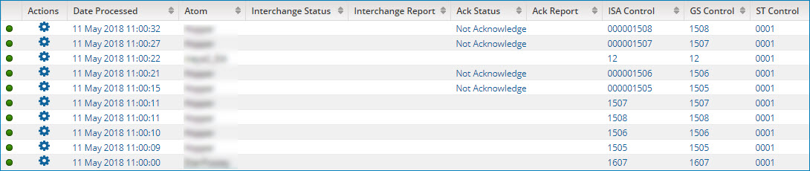

# Trading partner results table 

<head>
  <meta name="guidename" content="Integration"/>
  <meta name="context" content="GUID-b4361064-788c-4056-83e2-a055f62f9902"/>
</head>

The center of the Process Reporting page contains a table with your search results.

This is what the table looks like when you search for trading partner documents that use the X12 document standard.

Each row in the table represents a document and displays the following information. The column headings vary, based on which document standard you search for. Use the horizontal scroll bar to view additional columns.

Clicking on the timestamp listed in the Date Processed column opens a panel that provides document details.

These columns are included regardless of the document standard:

**Column**  
**Description**

**Status**  
 -    Success — The trading partner document was processed without errors.

-    Error — There was at least one error in processing the trading partner document.

** Actions**  
The menu has the following selections:

 -   **View Documents** — The document opens in the Document Viewer dialog.
-   **View Logs** — Events logged during the processing of a specific document are opened in the Show Log dialog.
 -   **Load Execution** — The process executions results table is displayed with the execution in question as the single result.

**Date Processed**  
The date when the trading partner document was processed during the process execution. The date and time are in the format yyyy-MM-dd hh:mm:ss aa, using the time zone in which you are accessing the UI.

**Atom**  
The name of the Atom on which the trading partner document’s process execution ran. The Atom name is a link to the Atom Information panel in the Atom Management page \(**Manage** \> **Atom Management**\), in which Atom status information is available.

**Size \(kB\)**   
 The trading partner document’s size, in kilobytes.

## Custom documents 

These additional columns are included for Custom documents:

**Column**    
**Description**

**From Trading Partner**  
he name of the trading partner component for the sending trading partner.

**To Trading Partner**  
The name of the trading partner component for the receiving trading partner.

## EDIFACT documents 

These additional columns are included for EDIFACT documents:

**Column**  
**Description**

**Ack Status**  
The acknowledgment status. The possible values are Accepted, Received, and Rejected.

**Ack Report**  
The acknowledgment report.

**Sender ID**  
The unique identifier for the sending trading partner.

**Receiver ID**  
 The unique identifier for the receiving trading partner.

**Interchange Control Reference**  
The Interchange Control Reference number.

**Message Type**  
A code identifying the type of message.

**Message Reference Number**  
A unique message reference assigned by the sender.

**Interchange Date**  
The date of preparation. The format is yyMMdd.

**Interchange Time**  
The time of preparation. The format is HHmm.

**Ack Requested**  
The Acknowledgment Request.

**Outbound Validation Status**  
The outbound validation status. Possible values are Success, Error - Interchange, Error - Message, and N/A. For inbound interchanges — or outbound interchanges for which the outbound validation option is not selected in the sending trading partner — the value is “N/A”.

**Outbound Validation Report**    
The outbound validation report contains descriptions of errors present in an outbound interchange. If the outbound validation option is not selected in the sending trading partner, the value is “N/A”.

## HL7 documents 

These additional columns are included for HL7 documents:

**Column**  
**Description**

**Accept Ack Status**  
The Accept Acknowledgment Status. Possible values are: Commit Accept, Commit Error, and Commit Reject.

**Accept Ack Report**  
The Accept Acknowledgment Report.

**Ack Status**  
The acknowledgment status. The possible values are Application Accept, Application Error, and Application Reject.

**Ack Report**  
 The acknowledgment report.

**Sender Application ID**  
This field uniquely identifies the sending application among all other applications within the network enterprise.

**Sender Facility ID**  
This field further describes the sending application.

**Receiver Application ID**  
This field uniquely identifies the receiving application among all other applications within the network enterprise.

**Receiver Facility ID**  
This field further describes the receiving application.

**Message Control ID**  
This field contains a number or other identifier that uniquely identifies the message.

**Message Type**  
 A code identifying the type of message.

**Version**  
The version, for example, v25.

**Is Valid Message?**  
Identifies whether incoming data meets the requirements of the referenced profile’s segment and element configuration, including mandatory fields, data types, and minimum/maximum lengths.

**Outbound Validation Status**  
The outbound validation status. Possible values are Success, Error - Interchange, Error - Message, and N/A. For inbound interchanges — or outbound interchanges for which the outbound validation option is not selected in the sending trading partner — the value is “N/A”.

**Outbound Validation Report**  
The outbound validation report contains descriptions of errors present in an outbound interchange. If the outbound validation option is not selected in the sending trading partner, the value is “N/A”.

## ODETTE documents

These additional columns are included for ODETTE documents:

**Column**  
**Description**

**Ack Status**   
The acknowledgment status. The possible values are Accepted, Received, and Rejected.

**Ack Report**  
The acknowledgment report.

**Sender ID**  
The unique identifier for the sending trading partner.

**Receiver ID**  
The unique identifier for the receiving trading partner.

**Interchange Control Reference**  
The Interchange Control Reference number.

**Message Type**  
A code identifying the type of message.

**Message Reference Number**  
A unique message reference assigned by the sender.

**Interchange Date**  
The date of preparation. The format is yyMMdd.

**Interchange Time**   
The time of preparation. The format is HHmm.

**Ack Requested**    
The Acknowledgment Request.

**Outbound Validation Status**  
The outbound validation status. Possible values are Success, Error - Interchange, Error - Message, and N/A. For inbound interchanges — or outbound interchanges for which the outbound validation option is not selected in the sending trading partner — the value is “N/A”.

**Outbound Validation Report**  
The outbound validation report contains descriptions of errors present in an outbound interchange. If the outbound validation option is not selected in the sending trading partner, the value is “N/A”.

## RosettaNet documents 

These additional columns are included for RosettaNet documents:

**Column**  
**Description**

**Ack Status**  
The acknowledgment status. The possible values are Acknowledged, Error - No Acknowledgement Returned, Exception, and Not Expected.

**Ack Report**  
The acknowledgment report.

**Sender ID**  
The unique identifier for the sending trading partner.

**Receiver ID**  
 The unique identifier for the receiving trading partner.

**Known Initiating Partner ID**  
 If the Known Initiating Partner ID document property was set to distinguish the known initiating trading partner from the sending trading partner, that document property value is shown in this column. Otherwise, the Sender ID is shown.

**Is Secure Transport Required**  
 \(RosettaNet 2.0 only\) A value of Yes indicates the document must be transported from the next hub in a secure way. A value of No indicates the document does not need to be transported from the next hub in a secure way.

**Framework Version**  
 The version of the RosettaNet Implementation Framework that specifies the document structure — 1.1 or 2.0.

**PIP Code**  
The Partner Interface Process \(PIP\) code.

**PIP Version**  
The unique version number of the PIP document.

**Global Process Code**  
  \(RosettaNet 1.1 only\) The name of the PIP specification document.

**Global Business Action Code**  
 The business action.

**Global Document Function Code**  
  \(RosettaNet 1.1 only\) Specifies whether the document is a Request, Response, or neither \(N/A\).

**From Global Partner Role Classification Code**  
 The code identifying the role the sending trading partner plays in the PIP.

**To Global Partner Role Classification Code**   
 The code identifying the role the receiving trading partner plays in the PIP.

**From Global Business Service Code**  
 The code identifying the sending trading partner’s business service network component.

**To Global Business Service Code**  
 The code identifying the receiving trading partner’s business service network component.

**Business Activity Identifier**  
 The code identifying the business activity within the PIP.

**Process Instance Identifier**  
 \(RosettaNet 1.1 only\) The unique identifier for the process instance.

**Transaction Instance Identifier**  
 The unique identifier for the transaction instance.

**Action Instance Identifier**  
 The unique identifier for the action instance.

**In Response To Global Business Action Code**  
 If the document is a response, the business action of the request.

**In Response To Instance Identifier**  
 If the document is a response, the action instance identifier of the request.

**Global Usage Code**  
 Indicates whether the document is associated with a Production or Test mode interchange.

**Attempt Count**    
 \(RosettaNet 1.1 only\) The number of times the transaction has been attempted — for example, 1 for the first attempt.

 **Date Time**   
The date and time of the message delivery.

**Outbound Validation Status**  
The outbound validation status. Possible values are Success, Error - Message, and N/A. For outbound interchanges for which the outbound validation option is not selected in the sending trading partner, the value is “N/A”. No value is shown for inbound interchanges.

**Outbound Validation Report**  
The outbound validation report contains descriptions of errors present in an outbound interchange. If the outbound validation option is not selected in the sending trading partner, the value is “N/A”. No value is shown for inbound interchanges.

## Tradacoms documents 

These additional columns are included for Tradacoms documents:

**Column**   
 **Description**

**Validation Status**  
 The validation status. The possible values are Success and Error.

**Validation Report**  
 The validation report contains descriptions of segment validation errors.

**Sender Name**  
 The name of the sending trading partner.

**Receiver Name**  
 The name of the receiving trading partner.

**Message Type**  
 A code identifying the type of message.

**Date**  
 The date of the message delivery.

**Time**  
  The time of the message delivery.

**Sender Transmission Reference**  
 The sending trading partner’s reference for the message.

**Receiver Transmission Reference**  
 The receiving trading partner’s reference for the message, if known to the sending trading partner.

**Application Reference**  
 The code enabling the receiving trading partner to identify whether the message contains data for a particular type of application.

**Transmission Priority Code**  
 The code for the message transmission priority.

**File Generation Number**  
 This number is generated by the sending trading partner to uniquely reference the transmitted file.

**File Version Number**  
 This number is generated to uniquely reference a copy of the transmitted file.

## X12 documents 

These additional columns are included for X12 documents:

**Column**  
 **Description**

**Interchange Status**  
The interchange acknowledgment status. This should be identical to the acknowledgment status.

**Interchange Report**  
The interchange acknowledgment report contains descriptions of interchange segment validation errors.

**Ack Status**  
 The acknowledgment status. The possible values are Accepted, Accepted with Errors, Partially Accepted, and Rejected.

**Ack Report**  
 The acknowledgment report.

**ISA Control**  
 The number that uniquely identifies the interchange.

**GS Control**  
 The group control number. This number uniquely identifies each trading partner in an interchange.

**ST Control**  
 The transaction set control number.

**Functional ID**  
  The identifier for the type of message in the functional group, such as Functional acknowledgment \(FA\) or a Purchase Order transaction \(PO\).

**Transaction Set**  
 The identifier code for the transaction set, for example, 850.

**Is Valid Message?**  
 Identifies whether incoming data meets the requirements of the referenced profile’s segment and element configuration, including mandatory fields, data types, and minimum/maximum lengths.

**Test Indicator**  
 Specifies whether the interchange is for testing or production.

 -   T — Test

 -   P — Production

**Sender ID Qualifier**  
 For outbound interchanges, the Interchange ID Qualifier, which categorizes the Sender ID.

**Sender ID**  
  The unique identifier for the sending trading partner.

**Receiver ID Qualifier**  
 For inbound interchanges, the Interchange ID Qualifier, which categorizes the Receiver ID.

**Receiver ID**  
 The unique identifier for the receiving trading partner.

**App Sender ID**  
 For outbound interchanges, the Application Sender’s Code, which identifies the sending trading partner.

**App Receiver ID**  
 For inbound interchanges, the Application Receiver’s Code, which identifies the receiving trading partner.

**Standard ID**  
 Displays the same information as in the Standard column.

**Standard**  
The Interchange Control Standard.

  -   U — US EDI Community of ASC X12, TDCC and UCS

 -   X — US EDI Community of ASC X12

**GS Version**  
The Version/Release/Industry identifier code, which is a code for the version, release, and industry of the standard for the type of document being sent. Includes the prefix “00” — for example, for X12 version 5010, the value would be 005010.

**Agency Code**  
The Responsible Agency Code, which is a code used with GS Version \(GS08\) to identify the agency that has control of the standard for the type of document being sent.

 -   T — Transportation Data Coordinating Committee

  -   X — Accredited Standards Committee

**GS Date**  
The date that the interchange was prepared. The format is yyyyMMdd.

**GS Time**  
The time that the interchange was prepared. The format is HHmm.

**Outbound Validation Status**  
The outbound validation status. Possible values are Success, Error - Interchange, Error - Transaction Set, and N/A. For inbound interchanges — or outbound interchanges for which the outbound validation option is not selected in the sending trading partner — the value is “N/A”.

**Outbound Validation Report**     
The outbound validation report contains descriptions of errors present in an outbound interchange. If the outbound validation option is not selected in the sending trading partner, the value is “N/A”.