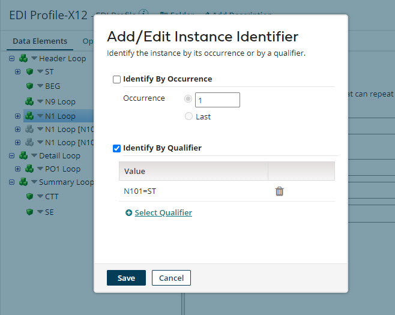
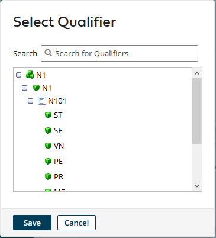

# Add/Edit Instance Identifier dialog

<head>
  <meta name="guidename" content="Integration"/>
  <meta name="context" content="GUID-006c796f-48b7-49aa-a5c6-25fa7849c510"/>
</head>

The Add/Edit Instance Identifier dialog is used to add an instance identifier to an EDI, XML, or JSON profile or edit an instance identifier.

You can define instance identifiers for a loop or segment in an EDI profile, a repeating element in an XML profile, or a repeating array element in a JSON profile. The instance identifier represents a unique copy of the loop, segment, repeating element, or repeating array element and its child elements based on specified instance identification criteria.

The dialog opens when **Add Instance Identifier** or **Edit Instance Identifier** is selected in the action menu for a loop, segment, repeating element, or repeating array element in a profile’s **Data Elements** tab.

**Name**   
**Description**

**Identify By Occurrence**   
If selected, the instance is based on a numeric **Occurrence** within a single transaction. Selecting **Last** bases the instance on the last occurrence.

**Identify By Qualifier**   
If selected, the instance is based on a selected qualifier defined with the element and child elements.

Clicking **Select Qualifier** opens the Select Qualifier dialog, which is used to select the qualifier.

