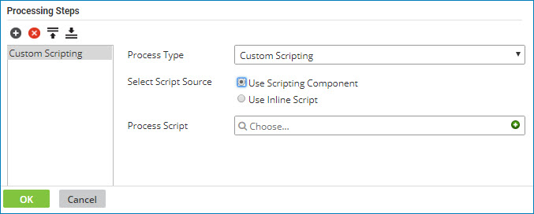

# Adding a custom scripting step with a Scripting component

<head>
  <meta name="guidename" content="Integration"/>
  <meta name="context" content="GUID-57d40ef7-9362-400b-aed1-5885c0c7f475"/>
</head>

To add a custom scripting step with a Scripting component to a Data Process step, select the **Process Type** Custom Scripting and the **Script Source** Use Scripting Component.

1.  Add a Data Process step to your process or edit an existing Data Process step.

    The Data Process step dialog opens.

2.  Click the  **Add Step** icon.

3.  In the **Process Type** list, select Custom Scripting.

4.  For **Script Source**, select Use Scripting Component.

    

5.  In the **Process Script** field, do one of the following:

-   To locate an existing Process Scripting component, click in the field.

-   To create a new Process Scripting component, click ** Create**.

    A new Process Scripting component opens in a separate tab.

6.  When you are finished, click **OK** to save the Data Process step.