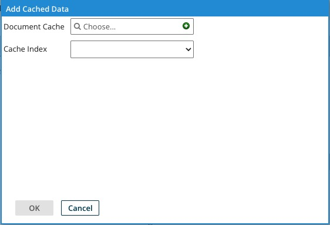

# Adding a document cache to a map

<head>
  <meta name="guidename" content="Integration"/>
  <meta name="context" content="GUID-e1c2ca12-19f5-4648-a4bb-f23f426a5cab"/>
</head>

To combine documents from different sources, you can add document caches to Database, EDI, Flat File, JSON, and XML maps.

## Procedure

1.  Select, edit, or create a map.

2.  Depending on the map, click the arrow next to one of the following in the source column and then select **Add Cached Data**:

    1.  For EDI, Flat File, or XML maps, click **Elements**.

    2.  For a database map, click **Fields**.

    3.  For a JSON map, click **Object**.

    The Add Cached Data dialog opens. You can add a document cache to any mapping element but not to another document cache.

    

3.  In **Document Cache** select, edit, or add a Document Cache component.

4.  In **Cache Index** select an index and click **OK**.

    A new tab appears for the document cache.

5.  Click the **Browse** icon, select an element from the map source profile to link to the key, and click **OK**.

6.  Repeat step 5 for each key.

7.  Click **OK** again to close the dialog.

    :::note

    If you need to add more than one cache index to a map, repeat step 2 and add the document cache containing the other index, then repeat steps 3-6.

    :::

8.  Map the required elements in the document cache and the source profile to elements in the destination profile.

9.  Click **Save** or **Save and Close**.
