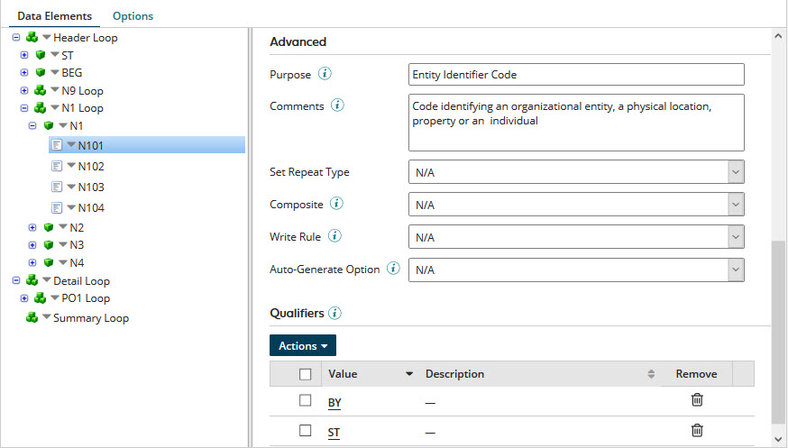

# Adding qualifiers to an EDI profile data element 

<head>
  <meta name="guidename" content="Integration"/>
  <meta name="context" content="GUID-db0c4e20-5859-48d8-a779-66870819919d"/>
</head>

Qualifiers for an EDI profile data element identify values that can be used in instance identifiers.

## Procedure

1.  Open the EDI profile.

2.  Select the **Data Elements** tab, expand the tree, and select the data element.

    The data element details appear in the EDI Element Details panel.

    

3.  **Optional:** To import qualifiers to the data element from an EDI standard:

    1.  In the Qualifiers table’s **Actions** menu, select **Import from Standard**.

        The Import Qualifiers from Standard dialog opens.

    2.  For each qualifier you want to import, select its check box.

        You can use the search field to filter the list.

        :::note

        You can import qualifier values from an EDI standard to data elements for which the standard defines values. Where it is possible to import qualifier values to a data element, doing so is preferable to adding qualifier values \(step 4\).

        :::

    3.  Click **Save**.

        Focus returns to the EDI Element Details panel. The Qualifiers table shows the imported qualifiers.

4. **Optional:** To add a qualifier\(s\) to the data element:

    1.  In the Qualifiers table’s **Actions** menu, select **Add**.

        The Add Qualifier dialog opens.

    2.  Type the qualifier **Value**.

    3.  To include a description in the qualifier definition, type the description in the **Description** field.

    4.  Click **Save**.

        Focus returns to the EDI Element Details panel. In the Qualifiers table, the newly added qualifier is shown.

    5.  For each additional qualifier you want to add, repeat substeps a–d.

5.  Click **Save** to save the profile.