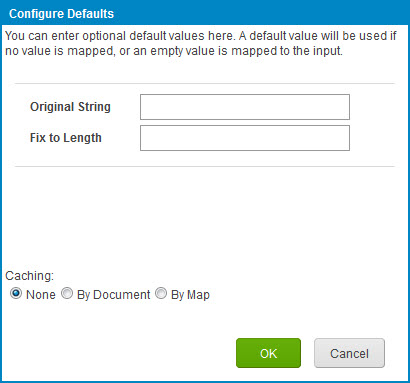
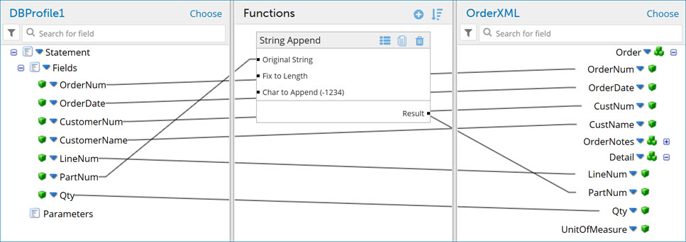

# Adding a standard function to a map

<head>
  <meta name="guidename" content="Integration"/>
  <meta name="context" content="GUID-b42ba05b-141a-4413-84ae-78d53abcf5e5"/>
</head>

To add a standard function to a map, use the Add a Function dialog, which is accessible in the map’s Functions column.

1.  Create or open a map.

2.  Click ** Add a function to the map** in the Functions column.

    The Add a Function dialog opens.

3.  Select a category and a function type, then click **OK**.

    If you select a Lookup, Connector or Custom Scripting function type, a dialog opens in which you must configure it. The dialog looks different, depending on the function type you chose.

4.  Configure the lookup, connector or custom scripting function, then click **OK**.

    The Configure Defaults dialog opens. The dialog looks different, depending on the function type you chose.

    

5.  Enter default values and select a caching option if desired. Click **OK**.

    A box containing the function and default values appears in the Functions column.

6.  Drag and drop fields from your source profile into your functions inputs.

7.  Drag and drop fields from your function outputs to your destination profile.

    

8.  Click **Save**.