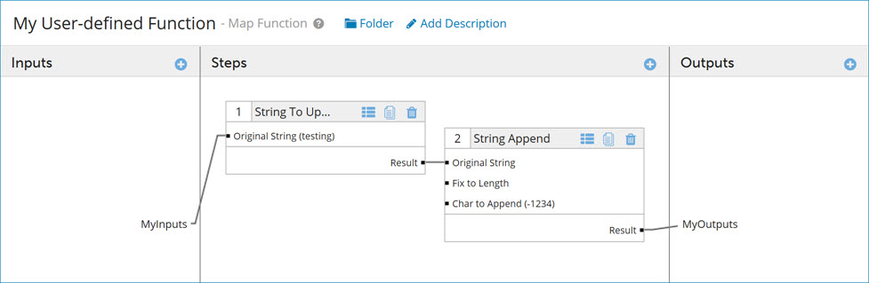
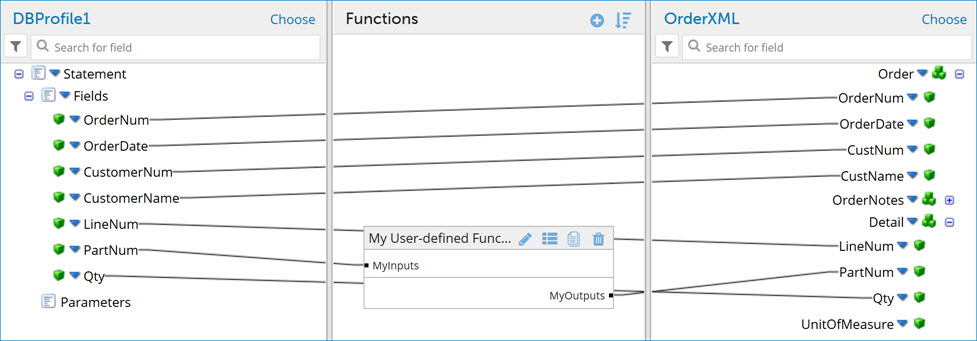

# Adding a user-defined function to a map

<head>
  <meta name="guidename" content="Integration"/>
  <meta name="context" content="GUID-f3136c18-52c4-423b-b71a-273465bd8080"/>
</head>

User-defined functions allow you to link together multiple standard functions. For example, you could concatenate strings in one step and append characters to the resulting string in a second step. Once created, user-defined functions can be reused just like standard functions.

1.  Create or open a map.

2.  Drag a Map Function from the Component Explorer into the Functions column or click ** Add a function to the map** in the Functions column.

    The Add a Function dialog opens. The User Defined category is selected by default.

3.  Click the **Create New Function** icon.

    A new tab opens which is named New Map Function.

4.  Enter a name for the function.

5.  In the Steps column, click ** Add a function step**.

    The Add a Function dialog opens.

6.  Select a category and a function type, then click **OK**.

    The Configure Defaults dialog opens. The dialog will look different, depending on the function type you chose.

7.  Enter default values and select a caching option if desired. Click **OK**.

    A box containing the function and default values appears in the Steps column.

8.  To add another function step, repeat steps 5-7.

9.  In the Inputs column, click ** Add an input parameter to the function**.

    The New Input dialog opens.

10. Enter a name and click **OK**.

    An input is added in the Input column.

11. In the Outputs column, click ** Add an output parameter to the function**.

    The New Output dialog opens.

12. Enter a name and click **OK**.

    An output is added in the Output column.

13. Drag and drop the function input to the first step.

14. Drag and drop the first step's result to the next step.

15. Repeat the previous step as needed to link the steps.

16. Drag and drop the last step's result to the function output.

    The example below shows a two-step function. The input is linked to step 1, step 1 is linked to step 2, and step 2 is linked to the output.

    

17. Click **Save and Close**.

    The function closes and you return to the map. The new function appears in the map.

18. Drag and drop fields from your source profile into your functions inputs.

19. Drag and drop fields from your function outputs to your destination profile.

:::note

Padding is added to profile elements with short names to make it easier to specify the elements as destinations for mappings. As a result, the line connecting the source element to the destination element may not extend to the start of the destination profile name.

:::

20. Click **Save**.