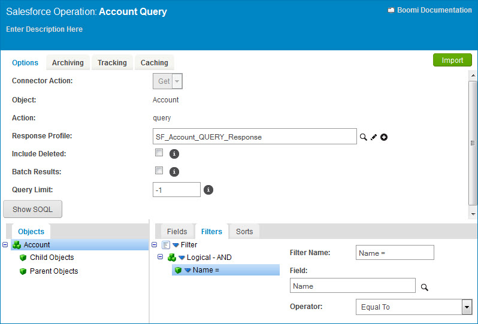
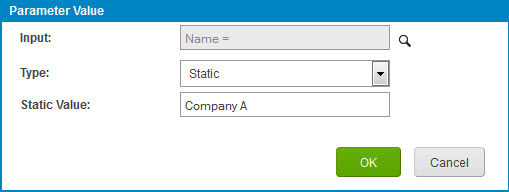

# Adding filters to an operation and passing in parameters

<head>
  <meta name="guidename" content="Integration"/>
  <meta name="context" content="GUID-b194bd5e-9caf-47e5-bfd7-e2652fae5877"/>
</head>

Whend adding filters to an operation, you can create multiple filters, add multiple parameters, and mix static and dynamic values. One common dynamic value used in the Start step is a filter that extracts records where the "last modified date" is greater than a value, then the parameter is the special **Last Run Date** value.

This example uses the Salesforce operation, however the configuration and filter support for other connectors may be different. See the individual connector documentation in the Application Connectors section for more information.

:::note

For a full list of available filter operators, refer to [Connector operations, filters, and parameter values](./c-atm-Connector_operations_filters_and_parameter_values_34d5ca37-6a21-43b6-a6f0-b2c165f7fd7f.md).

:::

1. Create or edit an Operation component.

2. Click the **Options** tab.

3. Click the **Import** button and use the wizard to generate the XML profile and configure the operation.

4. At the bottom of the page, add a filter.

5. Configure the filter with a user-defined name, the field to filter against, and a comparison operator.

   The user-defined name is displayed as the operation's inputs.

   

   :::note

   This filter name displays in the list of operation inputs when the operation is referenced.

   :::

6. Save the operation.

7. Create a new process and edit the Start step.

   The Start step dialog opens.

8. On the General tab, select the appropriate connector type, an existing connection, and the operation from above.

9. Click the **Parameters** tab.

10. Click **Add** to add a new parameter. This parameter will represent the value to pass into one of the filters defined in the operation.

11. Click **Browse** next to **Input** and select a filter to provide a value for and click **OK**.

    Notice this value is the same as the user-defined filter name above.

    

12. Set Type to **Static**.

13. Specify a value to pass into the operation input and then click **OK**.

14. Save the Operation component.
