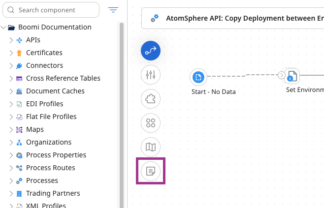

# Adding notes to a process

<head>
  <meta name="guidename" content="Integration"/>
  <meta name="context" content="GUID-1d1c3e5d-e337-4c56-b132-cd280405dc54"/>
</head>

You can add notes, each containing up to 250 characters, to a process for documentation purposes.

## Procedure

1. To add a note, click the **Notes** icon () on the process canvas.

   

   A note box opens in the canvas.

2. Type the note text in the box and click **Save**.

   The note box shrinks to a small icon that you can move on the canvas.

- To view the contents of the note, pause on the note icon.

- To move the note, click the  and drag it on the canvas.

## Results

:::note

You can edit or delete a note only if you are its author or an administrator.

- To edit a note, pause on the note icon and click ** Edit Note**.

- To delete a note, pause on the note icon and click ** Delete Note**. Then, in the confirmation dialog, click **OK**.

:::
