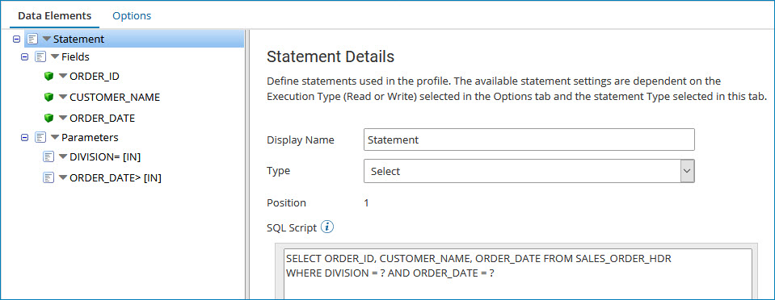

# Adding parameters to a database (legacy) profile

<head>
  <meta name="guidename" content="Integration"/>
  <meta name="context" content="GUID-7ae6e3a6-fee4-4a86-8e56-70555633bb3f"/>
</head>

:::note

The Database (Legacy) Profile and Database (Legacy) connector are no longer actively maintained. We encourage you to migrate to the updated [Database V2 connector](../Connectors/int-Database_V2_connector_7b04dbdd-ef36-4a2f-b6ff-b038b3f60ff2.mdx).

:::

Parameters allow you to insert dynamic values into your query, typically in the WHERE clause\(s\) to filter results. For example, if you wanted to extract only records that have been created or modified since the last time the process ran, you could design the query to accept a date value passed in from the connection. To use parameters, you need to modify the SQL statement itself.

## Procedure

1.  Create a database profile whose Type field is set to **Select**.

2.  On the Data Elements tab, select a **Statement** node.

3.  Modify the SQL statement and type a question mark to serve as a placeholder where each dynamic parameter should be inserted.

    For example: `SELECT ORDER_ID, CUSTOMER_NAME, ORDER_DATE FROM SALES_ORDER_HDR WHERE DIVISION = ? AND ORDER_DATE > ?`

    This query contains two placeholders: one for DIVISION and one for ORDER\_DATE. In the profile, you need to define two parameters that will be used to pass values into the query's placeholders \(the two question marks\).

4.  To add a parameter, click the drop-down arrow  next to **Parameters** and choose **Add Parameter**.

    For users familiar with database programming, parameters are "Prepared Statements".

5.  Click the newly-created parameter to edit its properties to the right.

    Make sure the Parameter data type matches the column it is evaluated against.

6.  Repeat these steps for each parameter expected by the query. Similar to output fields, one parameter must be defined for each placeholder \(question mark\) in the query. They are matched by position.

    

7.  When the process runs, the values defined in the Connection step for the parameters are passed into the query and replace the question marks before executing the SQL statement against the database.

8.  To remove a parameter, click the drop-down arrow and choose **Delete Field**.

9.  Click **Save**.