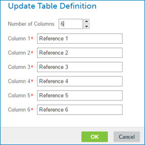

# Adding rows and columns to a cross reference table

<head>
  <meta name="guidename" content="Integration"/>
  <meta name="context" content="GUID-2e90ffff-995f-48d0-a520-43b43c1da79d"/>
</head>

The Update Table Definition dialog is used to manually add rows and columns to a cross reference table.

## Procedure

1.  Create or open a cross reference table component.

2.  To specify the number of columns, click the  **Update Table Definition** icon or link.

    The Update Table Definition dialog opens.

    

3.  Select the number of columns that you need.

    By default, the table definition has six columns. You can define from two to 20 columns.

4.  For each column, enter a column header name.

5.  Click **OK**.

6.  To add a row, click ** Add Row**.

    The new row appears after the last row in the table. You can add up to 10,000 rows.

7.  Click in the first column and type a value.

8.  Click in subsequent columns and type a value for each.

9.  Manipulate rows in the following ways:

    -   To select a row, turn on its check box.

    -   To copy rows, select one or more rows and click ** Copy Row\(s\)**.

    -   To delete rows, select one or more rows and click ** Delete Row\(s\)**.

10. Click **Save**.