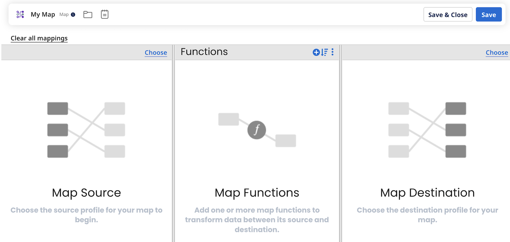

# Adding source and destination profiles to a map

<head>
  <meta name="guidename" content="Integration"/>
  <meta name="context" content="GUID-934bbee3-18be-432f-a114-20039110a851"/>
</head>

When adding a map to a process, it must have source and destination profiles.

1.  Create or open a map.

2.  Do one of the following to add the source or destination profile:

-   In **Map Source** or **Map Destination**, click **Choose** in the heading of the column and then continue with step 3.

-   Drag a profile from the Component Explorer into either the **Map Source** or **Map Destination** column. The profile's elements then appear in a new tab, and its name appears in the column heading.
3.  Do the following in the **Choose a Source Profile** or **Choose a Destination Profile** dialog:

1.  In **Profile Type**, select from the available list.

2.  In **Profile**, select an existing profile to use or click the plus \(+\) sign to create a new profile.

:::note

You can see recommendations and search across any type of profile components in additional process step screens including the **Cleanse** step, **Business Rules** step, and the common **Parameter Values** dialog, without having to select a specific profile type, such as XML or JSON. To create a new profile component, select a specific type.

:::

4.  When the map contains source and destination profiles, click **Save**.

