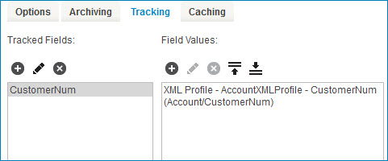

# Adding tracked fields to a connector operation

<head>
  <meta name="guidename" content="Integration"/>
  <meta name="context" content="GUID-f71821dd-95ee-4ebd-bfc9-3333262f56f6"/>
</head>

Tracked field labels are operation-independent. Different processes and operations can specify the same label and populate the same field. This CustomerNum tracked field example shows tracking enabled on a single operation's **Tracking** tab.

## Procedure

1.  Open the connector operation and click the **Tracking** tab.

2.  Click ** Add Tracked Field**.

    The list displays the tracked fields that exist on the Setup page's Document Tracking tab. You can configure more than one tracked field per connector operation.

3.  Select the tracked field.

    The list of field values appears on the right. This area is blank if this tracked field is new.

4.  Click ** Add Parameter**.

    The Parameter Value dialog opens.

5.  Select a parameter type.

6.  Depending on the parameter type that you select, you may have to select other values. Select those values and click **OK**.

    Most field value definitions are for the profile element parameter type. You can dynamically track document values by defining a specific profile element that captures the data processing through the connector. Review the connector documentation to understand the proper profile definition.

    Each field value, defined in order, builds the dynamic tracked field value from left to right.

    

7.  Save the connector operation.

8.  Deploy the latest revision of the process to include the tracked field updates.