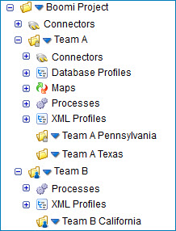

# Adding write restrictions to a folder

<head>
  <meta name="guidename" content="Integration"/>
  <meta name="context" content="GUID-99713c93-56f5-4a3d-903f-5d6461b965d0"/>
</head>

Administrators can limit users’ ability to change a folder and the components in it by adding write restrictions to the folder.

## About this task

Write restrictions are based on user roles. The administrator can use one of the standard roles, but it is more likely to create a custom role. After the administrator creates the role the role must be assigned to users.

Then the administrator can use the Folder Permissions dialog to add the role to the appropriate folder\(s\), so that only users with that role have write access to the folder\(s\) and the components in the folder\(s\). If no user role is assigned to a folder, then there are no write restrictions for that folder and anyone can save changes to it.

## Procedure

1.  Select the folder to which you want to add write restriction and click the blue arrow **** next to it.

2.  Select **Permissions**.

    The Folder Permissions dialog opens.

3.  Select one or more roles from the Available Roles list on the right.

4.  Click the **Add selected roles** button.

    The role is added to the Assigned Roles list on the left.

5.  Click **Save**.

    Only users with this role are able to change the folder and the components in it. If you have write access to the folder, its icon has a blue person on it: . If you do not have write access to the folder, its icon has a gray lock on it: .

## Folder write restrictions

Companies typically have an account in which some components are shared among their teams. But often companies do not want all users to have the ability to change certain components or folders in the account. They may want the programmers to be able to change certain components, the Human Resources people to change their components, the Finance team to change their components, etc. The company also may want to control components that are shared across teams so that one team cannot inadvertently change a shared component, which then breaks another team’s integration process.

Administrators can limit users’ ability to change a folder and the components in it by adding write restrictions to the folder. Adding write restrictions to a folder:

- Allows a certain group of users to rename, move \(via drag and drop\), delete, restore and create subs-folders in the folder. Also allows these users to create, edit, move \(via drag and drop\), delete and restore components in the folder.

- Prevents users without write access from performing the tasks listed above.

- Does not hide the folder and its contents from those without write access. Those users still have read access to the folder and its contents. Components are opened in read-only mode.

- Does not cause the folder's parent folder or its sub-folders to inherit the same restrictions.

- Allows all users to copy the folder \(and sub-folders, if it has any\) and its contents. The user must have write access to the destination folder. The write restrictions on the folder being copied are *not* transferred to the copy.

- Allows all users to copy a component from the folder. The user must have write access to the destination folder.

Adding write restrictions to a folder does not affect users’ ability to see where a component is used, via the Show Usage option. All users are able to see write restrictions on a folder, via the Permissions option. Clicking this option opens the Folder Permissions dialog.

The following table shows permissions that are required to perform actions on a folder that has write restrictions on it.

| Action  | Requires Write Access to the Folder? | Requires Write Access to Its Parent Folder? | Requires Write Access to Its Sub-folders? |
| --- | --- | --- | --- |
| Create Folder |  |  | Not applicable |
| Rename Folder |  |  |  |
| Copy Folder (must have write access to the destination folder) |  |  |  |
| Move Folder (the folder cannot be the account’s top-level folder; also must have write access to the destination folder.) |  |  |  |
| Restore Folder |  |  |  (also must have write access to the deleted sub-folders) |
| Delete Folder (the folder cannot be the account’s top-level folder)  |  |  |  |
| View Permissions on the Folder  | Not applicable | Not applicable | Not applicable |

The following table shows permissions that are required to perform actions on a component in a folder that has write restrictions on it.

| Action  | Requires Write Access to Its Folder? |
| --- | --- |
| Create Component |  (but do not need write access to the folder’s parent folder) |
| Copy Component |  (but must have write access to the destination folder) |
| Move Component |  (also must have write access to the destination folder) |
| Restore Component |  |
| Delete Component |  |
| Show Usage of Component | Not applicable |

Folders that already exist in your account and folders that you create have no write restrictions on them, unless they are added later by an administrator. These folders have a plain folder icon: . 

A folder to which the administrator has added write restrictions has one of two icons next to it. If you have write access to the folder, its icon has a blue person on it: .  If you do not have write access to the folder, its icon has a gray lock on it: .

Write restrictions are based on user roles, which are set up and managed by the system administrator. The administrator can use one of the standard roles, but it is more likely that he will create a custom role. The administrator assigns the role to one or more users. The administrator then uses the Folder Permissions dialog to add the role to the appropriate folder\(s\), so that only users with that role have write access to the folder\(s\) and the components in the folder\(s\).

:::note

Each user assigned the role must also have the Build Read and Write Access privilege. This privilege ensures that they can design, build, and modify processes and components on the Build page.

:::

For example, an account has a Boomi project. There are two teams working on the project: Team A and Team B. The teams share some connector components, so they store them in the Boomi Project folder, which has no write restrictions on it. The components that only Team A can change are stored in the Team A folder, which has the Team A custom role applied to it. The components that only Team B can change are stored in the Team B folder, which has the Team B custom role applied to it. Tom, who is a member of Team B, sees the following in the Component Explorer:

The Boomi Project folder has no write restrictions on it, therefore it has a regular folder icon next to it. Tom has full access to it and to its connector components. The Team A folder icon has a gray lock on it because Tom does not have write access to it. He can, however, see the folder and the components in it. The Team A Pennsylvania sub-folder icon also has a gray lock on it because Tom does not have write access to it. The Team A Texas sub-folder has no write restrictions on it, therefore it has a regular folder icon next to it and Tom has full access to it. The Team B folder and Team B California folder icons have a blue person on them because Tom has write access to both folders.