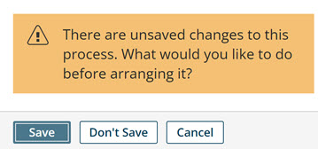

# Arranging steps, branches, and routes on the process canvas

<head>
  <meta name="guidename" content="Integration"/>
  <meta name="context" content="GUID-3bff3acb-602e-4c53-b384-1da61702d3c4"/>
</head>

With a single click you can automatically arrange the steps, branches, and routes on the process canvas to make your process easier to understand and maintain.

## Procedure

1.  Click the **Arrange** link on the process canvas.

    :::note
    
    If the process has unsaved changes, you are prompted to either **Save**, **Don't Save**, or **Cancel**.

    :::

    

    When the steps, branches, and routes are arranged, notes and unconnected steps are moved to the bottom left.

2.  Do one of the following:

    -   If you are satisfied with the arrangement, click **Save** or **Save and Close**.

    -   If you are dissatisfied with the arrangement, either make adjustments to the arrangement manually, or click the **Revert** link to revert the process to the last saved revision.