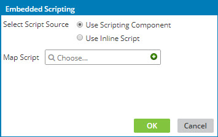

# Configuring a custom scripting function with a Scripting component

<head>
  <meta name="guidename" content="Integration"/>
  <meta name="context" content="GUID-dd0b1c17-ff25-4fb7-a6f3-b4d2eafd2e97"/>
</head>

You can use the Embedded Scripting dialog to configure a custom scripting function with a Scripting component.

## Procedure

1.  Create or open a map.

2.  Click ** Add a function to the map** in the Functions column.

    The Add a Function dialog opens.

3.  Select the **Custom Scripting** category.

4.  Select the **Scripting** function, then click **OK**.

5.  When the Embedded Scripting dialog opens, select **Use Scripting Component** as the script source.

    

6.  In the **Map Script** field, do one of the following:

    -   To locate an existing Map Scripting component, click in the field.

    -   To create a new Map Scripting component, click ** Create**.

        A new Map Scripting component opens in a separate tab.

7.  When you are finished, click **OK**.

8.  Map to the input\(s\) from the source profile or previous step and map the output\(s\) to the destination profile or next step.