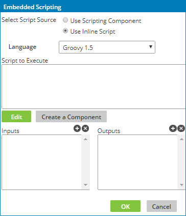

# Configuring a custom scripting function with an inline script

<head>
  <meta name="guidename" content="Integration"/>
  <meta name="context" content="GUID-f7e24cf4-8609-43de-a51b-333975617e61"/>
</head>

You can use the Embedded Scripting dialog to configure a custom scripting function with an inline script.

## Procedure

1.  Create or open a map.

2.  Click ** Add a function to the map** in the Functions column.

    The Add a Function dialog opens.

3.  Select the **Custom Scripting** category.

4.  Select the **Scripting** function, then click **OK**.

    The Embedded Scripting dialog opens with **Use Inline Script** as the default script source.

    

5.  Select a language from the **Language** list — either Groovy 1.5, Groovy 2.4, or JavaScript.

6.  In the **Inputs** list, do the following:

    1.  Click ** Add Input** to add one or more input variables.

    2.  For each input enter a name, select a data type, and click **Add**.

7.  In the **Outputs** list, do the following:

    1.  Click ** Add Output** to add one or more output variables.

    2.  For each output enter a name and click **Add**.

8.  Type the script in the **Script to Execute** box.

9.  To open a larger window for editing and working with script variables, click **Edit**.

    The edit window is similar to a full-function source code editor with features including line numbers, indentation, and syntax highlighting. For JavaScript scripts, the editor also supports syntax validation.

    You can customize the code editor by clicking ** Actions**.

    :::note
    
    If you prefer to type your script in a plain text box, click  to toggle between the Code Editor and the Plain Text Editor.

    :::

10. To save the inline script as a Scripting component for reuse in other maps, do the following:

    1.  Click **Create a Component**.

    The Create a Scripting Component dialog opens.

    2.  Type a name for the Scripting component and select a folder in which to store it.

    3.  If you want to use the new component as the source for this custom scripting function, select **Replace Inline Script**.

    4.  Click **Create**.

    The script source changes to **Use Scripting Component**, and the name of the new component appears in the **Map Script** field.

11. When you are finished, click **OK**.

    The Configure Defaults dialog opens.

12. Enter default values for the input variables.

13. Select a caching method and click **OK**.

14. Map to the input\(s\) from the source profile or previous step and map the output\(s\) to the destination profile or next step.