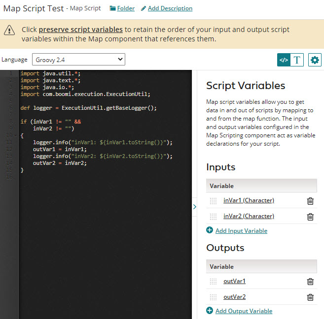

# Creating a Map Scripting component

<head>
  <meta name="guidename" content="Integration"/>
  <meta name="context" content="GUID-7660b3b2-5e50-4db1-879a-df24ce42cae5"/>
</head>

You can create a Map Scripting component for use as a custom scripting function in a Map Function component.

## About this task

You can also create a Map Scripting component by saving an inline script while you are configuring a custom scripting function

:::note

To preserve the order of your Map Scripting component's input and output variables throughout the Map component that references it, click the **preserve script variables** link at the top of the component before saving. This information is also repeated in Step 7 as a reminder.

:::

## Procedure

1.  On the **Build** page, do one of the following:

    -   Click **Create New** and select **Map Script** from the list. Skip to step 3.

    -   In the Component Explorer, click the blue arrow icon next to the desired folder, select **New Component**, and select **Scripting**.

2.  In the Create Component dialog, do the following:

    1.  Type a name for the Scripting component.

    The maximum length for a component name is 255 characters.

    2.  Click the **Browse** button and select a different Component Explorer folder.

    3.  In the **Script Type** field, select **Map Script**.

    4.  Click **Create**.

    The Map Script edit window opens.

    

3.  Select a language from the **Language** list — either Groovy 1.5, Groovy 2.4, or JavaScript.

4.  In the **Inputs** list, do the following:

    1.  Click ** Add Input Variable** to add one or more input variables.

    2.  For each input enter a name, select a data type, and click **OK**.

5.  In the **Outputs** list, do the following:

    1.  Click ** Add Output Variable** to add one or more output variables.

    2.  For each output enter a name and click **OK**.

6.  To modify the list of inputs or outputs, you can do the following:

    -   Reorder the list by dragging and dropping a variable's reorder icon  up or down in the list.

    -   Edit a variable by clicking on its name.

    -   Delete a variable by clicking ** Remove**.

7.  To persist the order of the input and output variables that you assigned in steps 4-6, click the **preserve script variables** link at the top of the component. Otherwise, the order of values defined in the Map Scripting component are neither reflected nor honored in the Map component.

8.  To hide the **Script Variables** pane, click **\>** in the vertical bar that separates the panes.

    You can redisplay the pane by clicking `<`.

9.  Type your script in the edit window.

    The edit window is similar to a full-function source code editor with features including line numbers, indentation, and syntax highlighting. For JavaScript scripts, the editor also supports syntax validation.

    You can customize the code editor by clicking ** Actions**.
    
    :::note

    If you prefer to type your script in a plain text box, click  to toggle between the Code Editor and the Plain Text Editor.

    :::

10. Click **Save** or **Save and Close**.

    The Map Scripting component is saved in the Map Scripts sub-folder of the folder you selected in step 2.

## Next steps

You can associate the completed Map Scripting component with a Map Function component.