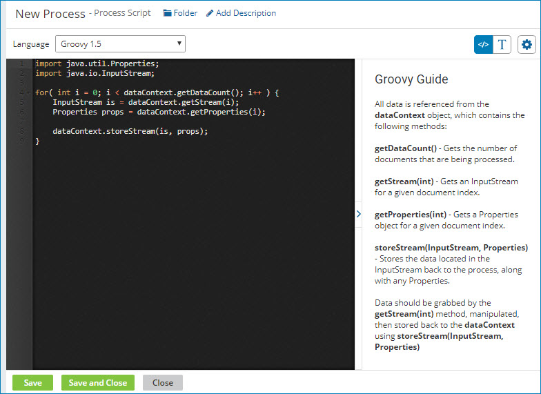

# Creating a Process Scripting component

<head>
  <meta name="guidename" content="Integration"/>
  <meta name="context" content="GUID-362f6d11-e3bf-484a-97ba-578b183c84af"/>
</head>

You can create a Process Scripting component for use in a Data Process step.

## About this task

:::note

You can also create a Process Scripting component by saving an inline script while adding a custom scripting step to a Data Processing step.

:::

## Procedure

1.  On the **Build** page, do one of the following:

    -   Click **Create New** and select **Scripting** from the list. Skip to step 3.

    -   In the Component Explorer, click the blue arrow icon next to the desired folder, select **New Component**, and select **Scripting**.

2. In the Create Component dialog, do the following:

   1. Type a name for the Scripting component.

      The maximum length for a component name is 255 characters.

   2. Click the **Browse** button and select a different Component Explorer folder.

   3. In the **Script Type** field, select **Process Script**.

   4. Click **Create**.

      The Process Script editor window opens.

      

3.  Select a language from the **Language** list — either Groovy 1.5, Groovy 2.4, or JavaScript.

    A default code block for the selected language appears in the edit window.

4.  To hide the coding guide pane, click **\>** in the vertical bar that separates the panes.

    You can show the pane again by clicking `<`.

5.  Type your script in the edit window.

    The edit window is similar to a full-function source code editor with features including line numbers, indentation, and syntax highlighting. For JavaScript scripts, the editor also supports syntax validation.

    You can customize the code editor by clicking ** Actions**.

    :::note

    If you prefer to type your script in a plain text box, click  to toggle between the Code Editor and the Plain Text Editor.

    ::: 

6.  After finishing, click **Save** or **Save and Close**.

The Process Scripting component saves in the Process Scripts subfolder of the folder you selected in step 2.

## Next steps

You can associate the completed Process Scripting component with a Data Process step.