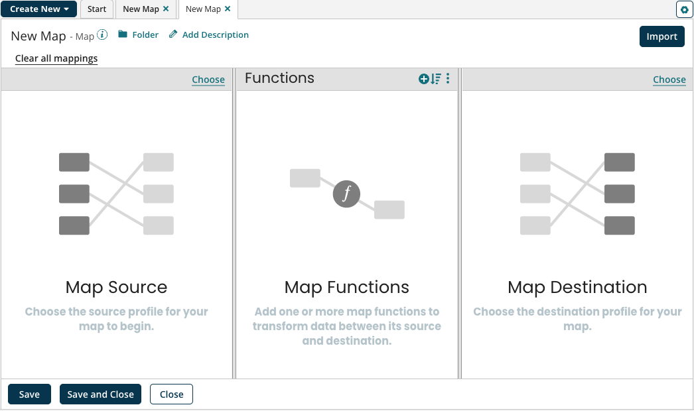

# Creating a map

<head>
  <meta name="guidename" content="Integration"/>
  <meta name="context" content="GUID-35c80e54-f0a8-44dd-bd2f-cba55e43566c"/>
</head>

Create map components for reference in Map steps where needed for converting data from one layout or format to another.

## Procedure

1. On the Build page, click **New**.

   The Create Component dialog opens.

2. Search for or select **Map** from the Type list.

3. Type a name for the map.

   The maximum length is 255 characters.

   The map appears on a tab with the name you entered.

   

4. (Optional) If you do not want the map to be stored in the default folder, click the **Folder** button and select the desired folder.

5. Click **Save** to save changes and continue working or click **Save and Close** to save changes and cloes the map.