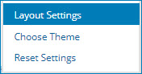
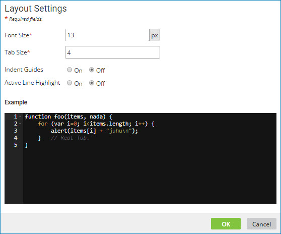
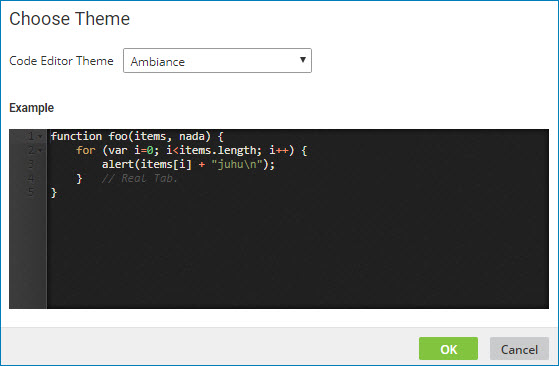

# Customizing your code editor settings

<head>
  <meta name="guidename" content="Integration"/>
  <meta name="context" content="GUID-f2255377-2a5d-4a41-a2f3-2fc33c8d8392"/>
</head>

You can customize and save settings for the custom scripting code editor, including font size, tab indentation, highlighting, and color scheme.

## About this task

Custom settings can be specified anywhere that the code editor is accessible. You can customize the editor while you are creating a Scripting component, adding a custom scripting step to a process, configuring a custom scripting function, or editing SQL statements. The settings that you specify are in effect for every instance of the editor and they persist across user sessions.

## Procedure

1.  From within the code editor, click ** Actions**.

    The options for customizing the code editor are displayed.

    

2.  To customize the basic layout of the editor window, do the following:

    1.  Click **Layout Settings**

    

    2.  Change one or more of the following settings:

        **Font Size**   
        Specify a font size between 1 and 200 pixels. The default is 13.

        **Tab Size**   
        Specify the number of characters that a tab should indent. The tab size can be from 1 to 20 characters. The default is 4.

        **Indent Guides**   
        Turn on or off the option to show the spacing between defined tab stops.

        **Active Line Highligh**t   
        Turn on or off the option to highlight the line where your cursor is positioned.

        The settings that you specify are shown in the Example window.

3.  To customize the color scheme of the editor window, do the following:

    1.  Click **Choose Theme**.

        

    2.  Select a theme from the **Code Editor Theme** list.

        The theme that you select is shown in the Example window.

4.  To reset the code editor to the default settings, click **Reset Settings**.