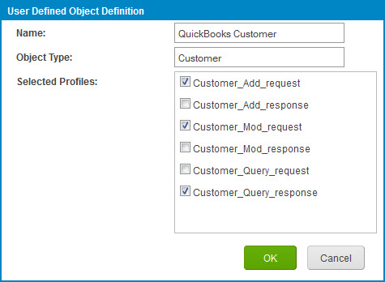

# Defining object definitions for a process

<head>
  <meta name="guidename" content="Integration"/>
  <meta name="context" content="GUID-9c6ce139-eea8-44fb-8737-21efa733674c"/>
</head>

Add or edit object definitions in the Extensions dialog.

## Procedure

1.  Open the process and click the **Extensions** link above the process canvas.

    The Extensions dialog opens.

2.  Select the **Object Definitions** tab.

    

3.  Click **Add Object Definition**.

    The User Defined Object Definition dialog opens.

    

4.  In the **Name** field, type the object definition name.

5.  In the **Object Type** field, type the object type.

6.  In the **Selected Profiles** list, select the check box adjacent to each profile component to include in the object definition.

7.  Click **OK**.

The User Defined Object Definition dialog closes and focus returns to the **Object Definitions** tab.

8.  For each XML profile component in the object definition, set the Content Root:

    1.  Click ** Choose Content Root for Profile**.

    A dialog opens.

    2.  Click the name of the element to set as the Content Root.

    3.  Click **OK**.

        The dialog closes, and focus returns to the **Object Definitions** tab.

    If you do not manually set a Content Root, the root element is used.

9.  For each profile component in the object definition, lock fields to prevent them from being customized:

    1.  Click ** Choose Locked Fields for Profile**.

    The Locked Fields dialog opens.

    2.  For each field you want to lock, select the check box adjacent to the element name.

    3.  When you are done locking fields, click **OK**.

        The Locked Fields dialog closes, and focus returns to the **Object Definitions** tab.

10. Set aliases:

    1.  Click ** Edit Aliases**.

    The Aliases dialog opens.

    2.  For each alias you want to set, select the check box adjacent to the element name, and in the adjacent field that appears, type the alias.

    3.  When you are done setting aliases, click **OK**.

        The Aliases dialog closes, and focus returns to the **Object Definitions** tab.

11. Repeat steps 3–10 for each additional object definition you want to define.

12. When you are finished defining object definitions, click **OK**.

13. Click **Save**.

After defining object definitions, you need to define data map extensions. See the topic To Define Data Map Extensions for a Process linked below.