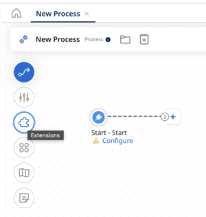

# Defining process property extensions for a process

<head>
  <meta name="guidename" content="Integration"/>
  <meta name="context" content="GUID-ddc497bc-919a-4a08-9121-540f50e7a916"/>
</head>

Add or edit process properties extensions in the Extensions dialog.

1. Open the process and click the **Extensions** icon on the process canvas.

   

   The Extensions dialog opens.

2. On the **Process Properties** tab, in the drop-down list, select a process property component used in the process that has properties for which you want to define extensions.

3. Select the check box next to each property to extend.

4. Repeat steps 2–3 for each additional process property component that has properties for which you want to define extensions.

5. When you are finished defining extensions, click **OK**.

6. Click **Save**.