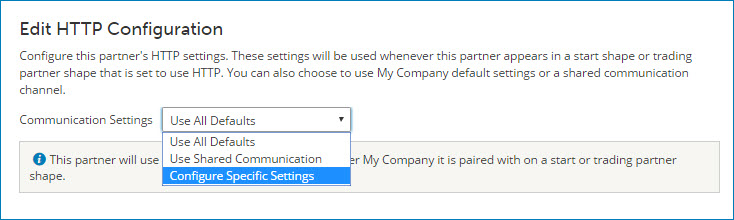

# Editing Trading Partner communication settings 

<head>
  <meta name="guidename" content="Integration"/>
  <meta name="context" content="GUID-688bb05b-2ce1-45bb-a602-5162889a6c4c"/>
</head>

This procedure is for adding or editing communication methods within a Trading Partner.

## About this task

These settings are used for the designated partner in a start step or trading partner steps.

## Procedure

1.  In the Trading Partner component configuration dialog, select the **Communication** tab. The configured methods and settings are shown.

    

2.  Do one of the following:

    -   To edit a previously-added method, click a method in the list and skip to step 3.
    -   To set up a new method, click **Add a Communication Method**, then select a method in the Add a Communication Method panel.
    

3.  In the Edit Configuration panel’s **Communication Settings list**, select one of the following:

    -   Use All Defaults — uses the settings configured in the paired My Company trading partner
    -   Use Shared Communication — uses settings of a connection
    -   Configure Specific Settings — uses settings that you configure here

    

4.  Click **Close** to save the configuration.

5.  Click **Save** or **Save and Close** to save the Communication method.