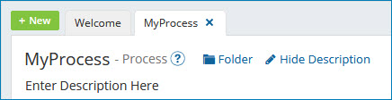

# Editing a component

<head>
  <meta name="guidename" content="Integration"/>
  <meta name="context" content="GUID-9d360c6e-5d3f-41e2-8dbe-687cb0570bde"/>
</head>

Edit components in the Build page.

## Procedure

1.  In the Component Explorer, navigate to the folder containing the component.

2.  Double-click the component.

    If the component is in a folder without write restrictions on it, or if you are assigned a user role that allows write access to the folder, the component opens on a tab on the process canvas and is editable.

    

    If the component is in a folder with write restrictions on it and if you are not assigned a user role that allows write access to the folder, the component opens in read-only mode.

3.  To edit the component's name, click in the text box next to the component type and type a new name.

    The maximum length is 255 characters.

4.  To edit the component's description, click **Edit Description Here** and type a new description.

5.  Click **Save** or **Save and Close**.

    For information on how to configure different types of components, see the specific topics in the Build section of the table of contents.