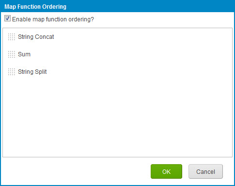

# Enabling and configuring map function ordering

<head>
  <meta name="guidename" content="Integration"/>
  <meta name="context" content="GUID-b777c7e3-3804-43ce-a9ab-d0df7daeac03"/>
</head>

Map function ordering lets you control the order in which map functions are applied. Map function ordering is useful, for example, when you need to store a value in a process property and use a different function to extract that value. Map function ordering may also be useful with specialized summing functions using process properties or external systems.

## Procedure

1.  In a map to which you have added functions, click ** Order function executions** in the Functions column.

    The Map Function Ordering dialog opens.

2.  Select **Enable map function ordering?**.

    A list of the functions appears.

    

3.  In the list, drag and drop reorder icons **** for functions until the list is in the desired order.

    As you drag a reorder icon, a dashed horizontal line dynamically shows the position into which the function would be moved if you were to drop the icon at the pointer location.

4.  Click **OK**.