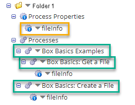

# Finding where a component is used

<head>
  <meta name="guidename" content="Integration"/>
  <meta name="context" content="GUID-7f30a40d-1c3e-4b7d-b748-f958cacf1b0f"/>
</head>

Components can be used in multiple processes or in other components. Use the Show Where Used filter in Component Explorer to see where a component is used.

## About this task

The Show Where Used filter shows all the locations where the selected component is referenced. In the following image, for example, the Show Where Used filter is applied to the Process Property "fileInfo". The filter results are displayed in a tree hierarchy, and include both the selected component and the parent components that directly reference it. In our example, results show that 3 parent processes, "Basic Box Examples", "Box Basics: Get a File", and "Box Basics: Create a File", all commonly use the "fileInfo" process property.

:::note

To see all the child components included in a Process component, you can open a Process component on the process canvas to see its configuration or if the process has been packaged, view its associated Packaged Component details from the **Deploy** \> **Packaged Components** page.

:::

## Procedure

1.  Click the blue arrow **** next to the component.

2.  Select **Show Where Used**.

    The filter shows all the components and processes where the selected component is referenced. If your selected component does not show any other components in the results list, this means that the component is not used or referenced by another component.

3.  To clear the usage results, select the blue filter icon **** and click **Clear all filters**.

## Results

The Show Where Used filter shows you the dependent or independent reference between the given component and the parent component which uses it. For more information about the different types of component references that exist on the Integration platform, see the topic [Component References](int-Component_references_8d7cf9db-2716-4301-b8d8-46eb9f055999.md).