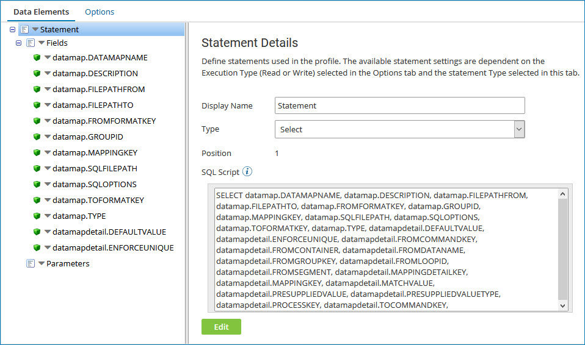

# Generating a database (legacy) profile with the Import Wizard

<head>
  <meta name="guidename" content="Integration"/>
  <meta name="context" content="GUID-630a835e-ef6e-41cf-8a1c-c7f7c6720f69"/>
</head>

:::note

The Database (Legacy) Profile and Database (Legacy) connector are no longer actively maintained. We encourage you to migrate to the updated [Database V2 connector](../Connectors/int-Database_V2_connector_7b04dbdd-ef36-4a2f-b6ff-b038b3f60ff2.mdx).

:::

The Import Wizard helps you quickly configure a database profile. The wizard auto-generates SQL statements that you can edit and creates the necessary output and parameter fields.

You can use the Import Wizard for Select, Dynamic Insert, Dynamic Update, and Dynamic Delete statements as well as Stored Procedures. For stored procedures, the Import Wizard provides a list of Oracle, MySQL, and MSSQL stored procedures and imports the data fields, so you do not need to know the names of the stored procedures nor the fields they contain. The wizard browses for Atoms in a Cloud and/or locally-deployed Atoms, browses the database schema metadata, and then builds the fields and parameters.

1. Create or open a database profile.

2. On the **Options** tab, select the correct execution type: **Read** or **Write**.

3. On the **Data Elements** tab, click on **Statement** if it is not selected.

4. Select a **Type**.

   For Read executions, the types are Select and Stored Procedure Read; for Write executions the types are Standard Insert/Update/Delete, Dynamic Insert, Stored Procedure Write, Dynamic Update, and Dynamic Delete.

   :::note

   You cannot use the import option if you select a **Standard Insert/Update/Delete** type for a Write execution.

   :::

5. For Stored Procedures, name the **Stored Procedure**. For Dynamic Write executions, name the **Table**.

6. Click the **Import** button.

    The Database Import Wizard opens.

7. For **Browse in**, select a **Cloud** or **Atom**.

8. In the **Connection** field, browse for a database connection, edit a selected connection, or add a new connection.

9. In the **Schema Filter** field, enter the name to filter on to reduce the number of schemas that are returned. You can enter a partial name with an asterisk \* wildcard.

10. In the **Object Filter** field, enter the name to filter on to reduce the number of tables that are returned. You can enter a partial name with an asterisk \* wildcard.

11. Click **Next**.

    The Import Wizard connects to the Atom and then returns a list of tables.

12. Choose a stored procedure, function, or one or more tables, and click **Next**.

    The Import Wizard connects to the Atom and then returns a list of columns for the selected tables.

13. If you did not select a delete query, choose one or more columns, and click **Next**.

14. If you selected an update or delete query, choose one or more conditions, and click **Next**.

15. Click **Finish** to close the Import Wizard.

    The Read profiles are now configured with the SQL statement and output fields with data types. Dynamic Update and Stored Procedure Read profiles list parameter fields.

    

    :::note
    
    The Database Profile Import Wizard does not generate cursor and resultsets columns for stored procedures. You can add them manually by clicking the blue arrow next to a **Field**, selecting **Insert Multiple Fields**, selecting the number of fields, and entering the Field Names.

    :::

16. After the SQL statement is generated, you can \(and often should\) edit the SQL statement in either the **SQL Script** field or the code editor. Click **Edit** to open the code editor.

    The auto-generated statement is a simple "select all" query that does not include table JOINs or WHERE clauses. You may need to modify the query to include this additional logic. Remember to add parameter fields if you are using dynamic values.
